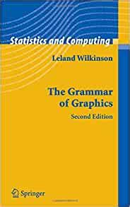
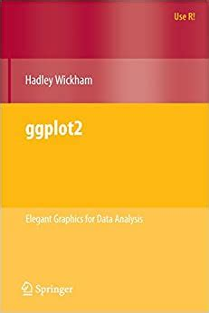

layout: false
class: inverse center middle text-white

.font200[Introduction to ggplot2]

```{r setup, include=FALSE}
knitr::opts_chunk$set(fig.width=4.25, fig.height=3.5, fig.retina=3,
                      out.width = "100%",
                      message=FALSE, warning=FALSE, cache = TRUE, 
                      autodep = TRUE, hiline=TRUE)

knitr::opts_hooks$set(fig.callout = function(options) {
  if (options$fig.callout) {
    options$echo <- FALSE
    options$out.height <- "99%"
    options$fig.width <- 16
    options$fig.height <- 8
  }
  options
})

options(
  htmltools.dir.version = FALSE, 
  width = 90,
  max.print = 9999,
  knitr.table.format = "html"
)

as_table <- function(...) knitr::kable(..., format='html', digits = 3)
```

---
layout: true
# Acknowledgements
---

- Slides and code adapted from Garrick Aden-Buie "Gentle ggplot2 tutorial" on GitHub: <http://github.com/gadenbuie/gentle-ggplot2>


---
layout: true
# How would you draw a line graph by hand?
---

.left-column[

__Grammar of Graphics__
]

.right-column[.font150[

1. Draw the axes, add tick marks.

2. Draw each line. Colour by country.

3. Add the axes labels.

4. Add a title.

5. Add a legend.

]]


---

---
layout: true
# How would you draw a bar graph by hand?
---

.left-column[

__Grammar of Graphics__
]

.right-column[.font150[

1. Draw the axes, add tick marks.

2. **Draw each bar.** Colour by country.

3. Add the axes labels.

4. Add a title.

5. Add a legend.

]]


---


---
layout: true
# The grammar of graphics
---

.left-column[

__Grammar of Graphics__
]

.right-column[.font150[

*  Breaks down graphics into its constituent parts. 

*  Focus on the relationship between the **variables** and the *visual properties* of the graph (e.g.*colour* = **country**).

* The **grammar of graphics =** rules/steps for plotting.

]]

---
layout: true
# The grammar of graphics
---

.left-column[
.font150[Links between variables and visual properties of the graph.
]]

.right-column[


__Thomas Lin Pedersen: Plot Anything With GGPLOT2__


]

---
layout: true
# What is *ggplot2*?
---

.left-column[

__Hadley Wickham__
]

.right-column[.font150[

* **gg**plot2 is the implementation of the **g**rammar of **g**raphics in R with some adaptations.

* ..."a powerful way of thinking about visualisation, as a way of **mapping between variables and the visual properties of geometric objects** that you can perceive."


]
.footnote[<http://disq.us/p/sv640d>]
]

---
layout: true
# Why use *ggplot2*?
---

- Package for .hl[functional] data visualization.

--
    1. Wrangle data
    
--

    2. Map data to visual elements
    
--

    3. Tweak scales, guides, axis, labels, theme
    
--

- Once you know the syntax it is easy to

--

  - .hl[Reason] about how data drives visualization

--

  - .hl[Iterate] to create multiple visualizations

--

  - Be .hl[consistent] in the visualizations you make.

---
layout: false

# Learning objectives

.left-column[

__ggplot2__
]

.right-column[.font150[
* `ggplot2` is a huge package with lots of options, but it's well documented and organized.


* We'll cover a lot, but won't have time to go into every specific. 


* The aim is to **equip** you with **where** and **what** to look for. 

]]


---
layout: true
# Getting started

---


**Option 1**: install the metapackage [tidyverse](http://tidyverse.org)

```r
install.packages('tidyverse')
```

**Option 2**: install just `ggplot2`

```r
install.packages('ggplot2')
```
---

## Load the tidyverse

```{r library-tidyverse, echo=TRUE, message=TRUE, warning=TRUE}
library(tidyverse)
```

---
## Other packages you'll need for this adventure

* [gapminder](http://www.gapminder.org/data/) dataset from the [`gapminder` package](https://github.com/jennybc/gapminder) by Jenny Bryan.


```{r library-extra, message=FALSE, eval=-1}
install.packages("gapminder")
library(gapminder)
```

---
layout: false
class: inverse center middle text-white

.font200[gg is for<br>Grammar of Graphics]

```{r guess-data-from-plot-og, echo=FALSE}
df_mpg <- mpg %>% 
  filter(class %in% c("compact", "suv")) %>% 
  filter(manufacturer %in% c("toyota", "ford", "audi")) %>% 
  filter(year == 2008) %>% 
  group_by(manufacturer, model) %>% 
  sample_n(1)

g <- ggplot(df_mpg) +
  aes(x = cty, y = hwy, color = class, shape = manufacturer) +
  geom_point(size = 4) +
  labs(x = NULL, y = NULL, shape = NULL, color = NULL) +
  theme_bw() +
  theme(
    panel.grid = element_blank(),
    plot.background = element_rect(fill = rgb(250, 250, 250, max = 255),
                                   color = "#777777")
  )
```
---

# Every plot starts with data


.left-code[
### MPG Ratings of Cars

- Manufacturer
- Car Type (Class)
- City MPG
- Highway MPG

]

.right-plot[
```{r guess-data-from-plot-data, echo=FALSE, results='asis'}
df_mpg %>% 
  select(manufacturer, class, cty, hwy, model) %>% 
  knitr::kable()
```
]


---
layout: true
# Guess the data behind this plot?
---

.left-code[
### MPG Ratings of Cars

- Manufacturer
- Car Type (Class)
- City MPG
- Highway MPG

#### What variable is represented by point shape?
]


.right-plot[
```{r guess-data-from-plot-2, echo=FALSE}
g + guides(color = FALSE, shape = FALSE) +
  theme_bw() +
  theme(axis.text = element_blank())
```
]

---
layout: true
# Guess the data behind this plot?
---

.left-code[
### MPG Ratings of Cars

- **Manufacturer**
- Car Type (Class)
- City MPG
- Highway MPG

#### What variable is represented by colour?
]

.right-plot[
```{r guess-data-from-plot-3, echo=FALSE}
g + guides(color = FALSE) +
  theme_bw() +
  theme(axis.text = element_blank())
```
]

---
layout: true
# Guess the data behind this plot?
---

.left-code[
### MPG Ratings of Cars

- Manufacturer
- **Car Type (Class)**
- City MPG
- Highway MPG


#### What variable is represented on the x axis?


]
.right-plot[
```{r guess-data-from-plot-1, echo=FALSE}
g + 
  theme_bw() +
  theme(axis.text = element_blank())
```
]

---
layout: true
# Guess the data behind this plot?
---

.left-code[
### MPG Ratings of Cars

- Manufacturer
- Car Type (Class)
- **City MPG**
- Highway MPG


#### What variable is on the Y axis?

]

.right-plot[
```{r guess-data-from-plot-5, echo=FALSE}
g + 
  theme_bw() +
  labs(x = "City", y = " ", shape = "Manufacturer", color = "Class")
```
]

---
layout: true
# Guess the data behind this plot?
---

.left-code[
### MPG Ratings of Cars

- Manufacturer
- Car Type (Class)
- City MPG
- **Highway MPG**


#### What is the title of the plot?

]

.right-plot[
```{r guess-data-from-plot-6, echo=FALSE}
g + 
  theme_bw() +
  labs(x = "City", y = "Highway", shape = "Manufacturer", color = "Class")
```
]

---
layout: true
# Guess the data behind this plot?
---

.left-code[
### **MPG Ratings of Cars**

- Manufacturer
- Car Type (Class)
- City MPG
- Highway MPG
]

.right-plot[
```{r guess-data-from-plot-7, echo=FALSE}
g + 
  theme_bw() +
  ggtitle("MPG Ratings") +
  labs(x = "City", y = "Highway", shape = "Manufacturer", color = "Class")
```
]


---
layout: false
# How do we express visuals in words?

.font120[
- **Data** to be visualized
]

--
.font120[
- **.hlb[Aes]thetic mappings** from data to visual component
]

--
.font120[
- **.hlb[Geom]etric objects** that appear on the plot
]

--
.font120[
- **.hlb[Stat]istics** transform data on the way to visualization
]

--
.font120[
- **.hlb[Coord]inates** organize location of geometric objects
]

--
.font120[
- **.hlb[Scale]s** define the range of values for aesthetics
]

--
.font120[
- **.hlb[Facet]s** group into subplots
]

--

--
.font120[
- **.hlb[Theme]s** the visual elements of the plot not linked to the data
]


---
layout: true
# gg is for Grammar of Graphics

.left-column[
### Data

```r
ggplot(data)
```
]

---

.right-column[
#### Tidy Data

1. Each **variable** forms a .hl[column]

2. Each **observation** forms a .hl[row]

3. Each **value** is a .hl[cell]
]

--

.right-column[
#### Start by asking

1. What information do I want to use in my visualization?

1. Is that data contained in .hl[one column/row] for a given data point?
]

---

.right-column[
```{r tidy-messy1, results='asis', echo=FALSE}
pop_simple <- gapminder %>% 
  filter(
    country %in% c("Syria", "Rwanda", "Chile"), 
    year >= 1997
  ) %>% 
  select(country, year, pop) %>% 
  mutate(pop = pop / 10^6)

messy_pop <- pop_simple %>% spread(year, pop)

knitr::kable(messy_pop, format = 'html')
```
]

--

.right-column[
```{r tidy-tidy1, result='asis', echo=-2}
tidy_pop <- gather(messy_pop, 'year', 'pop', -country)
tidy_pop %>%
  head(4) %>%
  as_table()
```
]


---
layout: true
# gg is for Grammar of Graphics

.left-column[
### Data
### Aesthetics

```r
+ aes()
```

]
---

.right-column[
Map data to visual elements or parameters

- year

- pop

- country

```{r tidy-tidy-show, result='asis', echo=F}
tidy_pop <- gather(messy_pop, 'year', 'pop', -country)
tidy_pop %>%
  head(4) %>%
  as_table()
```
]

---

.right-column[
Map data to visual elements or parameters

- year → **x**

- pop → **y**

- country → *shape*, *color*, etc.


```{r tidy-tidy-show-2, result='asis', echo=F}
tidy_pop <- gather(messy_pop, 'year', 'pop', -country)
tidy_pop %>%
  head(4) %>%
  as_table()
```

]

---

.right-column[
Map data to visual elements or parameters

```r
aes(
  x = year,
  y = pop,
  colour = country
)
```
]

---
layout: true
# gg is for Grammar of Graphics

.left-column[
### Data
### Aesthetics
### Geoms

```r
+ geom_*()
```
]

---

.right-column[
Geometric objects displayed on the plot

```{r geom_demo, echo=FALSE, fig.width=6, out.width="650px"}
minimal_theme <- theme_bw() +
  theme(
    axis.text = element_blank(),
    axis.ticks = element_blank(),
    panel.grid = element_blank(),
    panel.border = element_blank(),
    axis.title = element_blank(),
    plot.title = element_text(hjust = 0.5),
    text = element_text(family = "Fira Mono"),
    plot.background = element_rect(fill = "#FAFAFA", color = NA),
    panel.background = element_rect(fill = "#FAFAFA", color = NA)
  )

set.seed(4242)
df_geom <- data_frame(y = rnorm(10), x = 1:10)

g_geom <- list()
g_geom$point <- ggplot(df_geom, aes(x, y)) + geom_point() + ggtitle("geom_point()")
g_geom$line <- ggplot(df_geom, aes(x, y)) + geom_line() + ggtitle("geom_line()")
g_geom$bar <- ggplot(df_geom, aes(x, y)) + geom_col() + ggtitle("geom_col()")
g_geom$boxplot <- ggplot(df_geom, aes(y = y)) + geom_boxplot() + ggtitle("geom_boxplot()")
g_geom$histogram <- ggplot(df_geom, aes(y)) + geom_histogram(binwidth = 1) + ggtitle("geom_histogram()")
g_geom$density <- ggplot(df_geom, aes(y)) + geom_density(fill = "grey40", alpha = 0.25) + ggtitle("geom_density()") + xlim(-4, 4)

g_geom <- map(g_geom, ~ . + minimal_theme)

cowplot::plot_grid(plotlist = g_geom)
```
]

---

.right-column[
Here are the [some of the most widely used geoms](https://eric.netlify.com/2017/08/10/most-popular-ggplot2-geoms/)

.font70.center[
| Type | Function |
|:----:|:--------:|
| Point | `geom_point()` |
| Line | `geom_line()` |
| Bar | `geom_bar()`, `geom_col()` |
| Histogram | `geom_histogram()` |
| Regression | `geom_smooth()` |
| Boxplot | `geom_boxplot()` |
| Text | `geom_text()` |
| Vert./Horiz. Line | `geom_{vh}line()` |
| Count | `geom_count()` |
| Density | `geom_density()` |

<https://eric.netlify.com/2017/08/10/most-popular-ggplot2-geoms/>
]
]


---

.right-column[

See <http://ggplot2.tidyverse.org/reference/> for many more options

.font70[
```{r ggplot2-geom-names, echo=FALSE}
# geom_
old_width = options(width = 80)
lsf.str("package:ggplot2") %>% grep("^geom_", ., value = TRUE)
options(width = old_width$width)
```
]
]
--

.right-column[

Or just start typing `geom_` in RStudio
]


---
layout: true
# Our first plot!
---

.left-code[
```{r first-plot1a, eval=FALSE}
ggplot(tidy_pop)
```
]

.right-plot[
```{r first-plot1a, ref.label='first-plot1a', echo=FALSE, out.width="100%"}
```
]

---

.left-code[
```{r first-plot1b, eval=FALSE}
ggplot(tidy_pop,
  aes(x = year, #<<
      y = pop) #<<
  )
```
]

.right-plot[
```{r first-plot1b, ref.label='first-plot1b', echo=FALSE, out.width="100%"}
```
]

---

.left-code[
```{r first-plot1c, eval=FALSE}
ggplot(tidy_pop,
  aes(x = year,
      y = pop)
  ) +
  geom_point() #<<
```
]

.right-plot[
```{r first-plot1c, ref.label='first-plot1c', echo=FALSE, out.width="100%"}
```
]

---

.left-code[
```{r first-plot1, eval=FALSE}
ggplot(tidy_pop,
  aes(x = year,
      y = pop,
      color = country) #<<
  ) + 
  geom_point()
```
]

.right-plot[
```{r first-plot1, ref.label='first-plot1', echo=FALSE, out.width="100%"}
```
]

---

.left-code[
```{r first-plot2-fake, eval=FALSE}
ggplot(tidy_pop,
  aes(x = year,
      y = pop,
      color = country) 
  ) +
  geom_point() +
  geom_line() #<<
```

.font80[
```r
geom_path: Each group consists
of only one observation. 
Do you need to adjust the 
group aesthetic?
```
]
]

.right-plot[
```{r first-plot2-fake, ref.label='first-plot2-fake', echo=FALSE, out.width="100%"}
```
]
---

.left-code[
```{r first-plot2, eval=FALSE}
ggplot(tidy_pop,
  aes(x = year,
      y = pop,
      color = country) 
  ) +
  geom_point() +
  geom_line(
    aes(group = country)) #<<
```
]

.right-plot[
```{r first-plot2, ref.label='first-plot2', echo=FALSE, out.width="100%"}
```
]

---


.left-code[
```{r first-plot3, eval=FALSE}
g <- ggplot(tidy_pop, #<<
  aes(x = year,
      y = pop,
      color = country) 
  ) +
  geom_point() +
  geom_line(
    aes(group = country))

g #<<
```
]

.right-plot[
```{r first-plot3, ref.label='first-plot2', echo=FALSE, out.width="100%"}
```
]

---
layout: true
# gg is for Grammar of Graphics

.left-column[
### Data
### Aesthetics
### Geoms

```r
+ geom_*()
```
]
---

.right-column[
```r
geom_*(mapping = aes(), data, stat, position)
```

- `data` Geoms can have their own data
    - Has to map onto global coordinates

- `aes` Geoms can have their own aesthetics
    - Inherits global aesthetics
    - Have geom-specific aesthetics
        - `geom_point` needs `x` and `y`, optional `shape`, `color`, `size`, etc.
        - `geom_ribbon` requires `x`, `ymin` and `ymax`, optional `fill`
    - Use `?` to find out the aesthetics required and the ones you can change:
    `?geom_ribbon`
]

---

.right-column[
```r
geom_*(mapping, data, stat, position)
```

- `stat` Some geoms apply further transformations to the data
    - All respect `stat = 'identity'`
    - Ex: `geom_histogram` uses `stat_bin()` to group observations
    
- `position` Some adjust location of objects
    - `'dodge'`, `'stack'`, `'jitter'`
]

---
layout: true
# Our first plot!
---

.left-code[
```{r first-plot-geom-1, eval=FALSE}
g <- ggplot() +
  geom_point(
    data = tidy_pop, #<<
    aes(x = year, #<<
      y = pop, #<<
      color = country) #<<
  ) +
  geom_line(
    data = tidy_pop, #<<
    aes(x = year, #<<
      y = pop, #<<
      color = country, #<<
      group = country) #<<
    )

g
```
]

.right-plot[
```{r first-plot-geom-1, ref.label='first-plot-geom-1', echo=FALSE, out.width="100%"}
```
]

---
layout: true
# gg is for Grammar of Graphics

.left-column[
### Data
### Aesthetics
### Geoms

```r
+ geom_*()
```
]
---

.right-column[
```r
geom_*(mapping = aes(), data, stat, position)
```

- `data` Geoms can have their own data
    - Has to map onto global coordinates

.font150[What would the advantage be for a geom to have their own data?]

]

---
layout: true
# gg is for Grammar of Graphics

.left-column[
### Data
### Aesthetics
### Geoms
### Facet

```r
+facet_wrap() 

+facet_grid()
```
]
---

```{r geom_facet_setup, include=FALSE, eval = TRUE}
tidy_pop2 <- left_join(tidy_pop, select(gapminder, country, continent))

g <- ggplot(tidy_pop2) +
  aes(x = year,
      y = pop,
      color = country) +
  geom_point() +
  geom_line(aes(group = country))
```

.right-plot[
```{r geom_facet, eval = TRUE, echo=TRUE, out.width="90%", fig.width=6}
g + facet_wrap(~ country)
```
]

---

.right-column[
```{r geom_grid, eval = TRUE, echo=TRUE, out.width="90%", fig.width=6}
g + facet_grid(continent ~ country)
```
]

---
layout: true
# gg is for Grammar of Graphics

.left-column[
### Data
### Aesthetics
### Geoms
### Facet
### Labels

```r
+ labs()
```
]
---

```{r geom_label_setup, include=FALSE, eval = TRUE}
tidy_pop2 <- left_join(tidy_pop, select(gapminder, country, continent))

g <- ggplot(tidy_pop2) +
  aes(x = year,
      y = pop,
      color = country) +
  geom_point() +
  geom_line(aes(group = country))
```


.right-column[
```{r labs-ex, eval = TRUE, echo=TRUE, out.width="90%", fig.width=6}
(g <- g + labs(x = "Year", y = "Population (millions)"))
```
]

---
layout: true
# gg is for Grammar of Graphics

.left-column[
### Data
### Aesthetics
### Geoms
### Facet
### Labels
### Coords

```r
+ coord_*()
```
]
---

```{r geom_coord_setup, include=FALSE, eval = TRUE}
tidy_pop2 <- left_join(tidy_pop, select(gapminder, country, continent))

g <- ggplot(tidy_pop2) +
  aes(x = year,
      y = pop,
      color = country) +
  geom_point() +
  geom_line(aes(group = country))

g <- g + labs(x = "Year", y = "Population (millions)")
```


.right-column[
```{r coord-ex, eval = TRUE, echo=TRUE, out.width="90%", fig.width=6}
g + coord_flip()
```
]

---
layout: true
# gg is for Grammar of Graphics

.left-column[
### Data
### Aesthetics
### Geoms
### Facet
### Labels
### Coords
### Scales

```r
+ scale_*_*()
```
]
---

.right-column[ 
`scale` + `_` + `<aes>` + `_` + `<type>` + `()`

`<aes>` = parameter to adjust; `<type>` = Parameter Type
]
--

.right-column[
- I want to use a different color palette<br>`scale_fill_discrete()`<br>`scale_color_continuous()`
]

--

.right-column[
- I want to rescale y-axis as log<br>`scale_y_log10()`
]

--

.right-column[
- I want to change my discrete x-axis<br>`scale_x_discrete()`
]


---

```{r geom_scale_setup, include=FALSE, eval = TRUE}
tidy_pop2 <- left_join(tidy_pop, select(gapminder, country, continent))

g <- ggplot(tidy_pop2) +
  aes(x = year,
      y = pop,
      color = country) +
  geom_point() +
  geom_line(aes(group = country))

g <- g + labs(x = "Year", y = "Population (millions)")
```

.right-column[
```{r scale_ex1, eval = TRUE, out.width="90%", fig.width=6}
g + scale_color_manual(values = c("peru", "pink", "plum"))
```
]

---

.right-column[
```{r scale_ex2, eval = TRUE, out.width="90%", fig.width=6}
g + scale_y_log10()
```
]

---

.right-column[
```{r scale_ex4, eval = TRUE, out.width="90%", fig.width=6}
g + scale_x_discrete(labels = c("MCMXCVII", "MMII", "MMVII"))
```
]

---
layout: true
# gg is for Grammar of Graphics

.left-column[
### Data
### Aesthetics
### Geoms
### Facet
### Labels
### Coords
### Scales
### Theme

```r
+ theme()
```
]

---

.right-column[
Change the appearance of plot decorations<br>
i.e. things that aren't mapped to data

A few "starter" themes ship with the package

- `g + theme_bw()`
- `g + theme_dark()`
- `g + theme_gray()`
- `g + theme_light()`
- `g + theme_minimal()`

]

---

.right-column[

```{r theme_ex1, eval = TRUE, out.width="90%", fig.width=6}
g + theme_bw()
```

]

---
.right-column[
Huge number of parameters, grouped by plot area:

- Global options: `line`, `rect`, `text`, `title`
- `axis`: x-, y- or other axis title, ticks, lines
- `legend`: Plot legends
- `panel`: Actual plot area
- `plot`: Whole image
- `strip`: Facet labels
]
---

.right-column[
Theme options are supported by helper functions:

- `element_blank()` removes the element
- `element_line()`
- `element_rect()`
- `element_text()`
]

---

.right-column[
.font80[
```{r, eval = TRUE, out.width="90%", fig.width=6}
g + theme_bw() + theme(text = element_text(colour = "hotpink", size = 20))
```
]
]

---

.right-column[
You can also set the theme globally with `theme_set()`

```{r theme_set}
my_theme <- theme_bw() +
  theme(
    text = element_text(family = "Palatino", size = 12),
    panel.border = element_rect(colour = 'grey80'), 
    panel.grid.minor = element_blank()
  )

theme_set(my_theme)
```

All plots will now use this theme!
]

---

.right-column[
```{r, eval = TRUE, out.width="90%", fig.width=6, dependson='theme_set', echo = -1}
theme_set(my_theme)
g 
```
]

---

.right-column[
```{r, eval = TRUE, out.width="90%", fig.width=6, dependson='theme_set', echo = -1}
theme_set(my_theme)
g + theme(legend.position = 'bottom')
```
]

---
layout: false
# Save Your Work

To save your plot, use **ggsave**. 

```{r ggsave, eval=FALSE}
ggsave(
  filename = "my_plot.png",
  plot = my_plot,
  width = 10,
  height = 8,
  dpi = 100,
  device = "png"
)
```

---
layout: false
class: inverse center middle text-white

.font200[You have the power!]
---

class: inverse, center, middle

# "Live" Coding

```{r}
library(gapminder)
```

```{r reset_theme, include=FALSE}
theme_set(theme_gray())
```

---
# head(gapminder)

```{r head-gapminder, echo=FALSE}
head(gapminder)
```

---
# glimpse(gapminder)

```{r summary-gapminder, echo=FALSE, comment=""}
glimpse(gapminder)
```

--

Let's start with `lifeExp` vs `gdpPercap`

---
class: fullscreen
layout: true
---

.left-code[
```{r gapminder-le-gdp-1, fig.show="hide"}
ggplot(gapminder,
  aes(x = gdpPercap,
      y = lifeExp))
```
]

.right-plot[
`)
]

--

Add points...

---

.left-code[
```{r gapminder-le-gdp-2, fig.show="hide"}
ggplot(gapminder,
  aes(x = gdpPercap,
      y = lifeExp)) +
  geom_point() #<<
```
]

.right-plot[
`)
]

--

How can I tell countries apart?

---

.left-code[
```{r gapminder-le-gdp-3, fig.show="hide"}
ggplot(gapminder,
  aes(x = gdpPercap,
      y = lifeExp,
      color = continent)) +  #<<
  geom_point()
```
]

.right-plot[
`)
]

--

GDP is squished together on the left

---

.left-code[
```{r gapminder-le-gdp-4, fig.show="hide"}
ggplot(gapminder,
  aes(x = gdpPercap,
      y = lifeExp,
      color = continent)) +
  geom_point() +
  scale_x_log10() #<<
```
]

.right-plot[
`)
]

--

Still lots of overlap in the countries...

---

.left-code[
```{r gapminder-le-gdp-5, fig.show="hide"}
ggplot(gapminder,
  aes(x = gdpPercap,
      y = lifeExp,
      color = continent)) +
  geom_point() +
  scale_x_log10() +
  facet_wrap(~ continent) + #<<
  guides(color = FALSE)     #<<
```

No need for color legend thanks to facet titles
]

.right-plot[
`)
]

--

Lots of overplotting due to point size

---

.left-code[
```{r gapminder-le-gdp-6, fig.show="hide"}
ggplot(gapminder,
  aes(x = gdpPercap,
      y = lifeExp,
      color = continent)) +
  geom_point(size = 0.25) + #<<
  scale_x_log10() +
  facet_wrap(~ continent) +
  guides(color = FALSE)
```
]

.right-plot[
`)
]

--

Is there a trend?

---

.left-code[
```{r gapminder-le-gdp-7, fig.show="hide"}
ggplot(gapminder,
  aes(x = gdpPercap,
      y = lifeExp,
      color = continent)) +
  geom_line() + #<<
  #geom_point(size = 0.25) +
  scale_x_log10() +
  facet_wrap(~ continent) +
  guides(color = FALSE)
```
]

.right-plot[
`)
]

--

Okay, that line just connected all of the points sequentially...

---

.left-code[
```{r gapminder-le-gdp-8, fig.show="hide"}
ggplot(gapminder,
  aes(x = gdpPercap,
      y = lifeExp,
      color = continent)) +
  geom_line(
    aes(group = country) #<<
    ) +
  #geom_point(size = 0.25) +
  scale_x_log10() +
  facet_wrap(~ continent) +
  guides(color = FALSE)
```

.font200.center[&#x1F914;]
]

.right-plot[
`)
]

--

&#x1F4A1; We need time on x-axis!

---

.left-code[
```{r gapminder-gdp-year-1, fig.show="hide"}
ggplot(gapminder,
  aes(x = year, #<<
      y = gdpPercap, #<<
      color = continent)) +
  geom_line(
    aes(group = country)) +
  #geom_point(size = 0.25) +
  scale_y_log10() + #<<
  facet_wrap(~ continent) +
  guides(color = FALSE)
```
]

.right-plot[
`)
]

--

Can't see x-axis labels, though

---

.left-code[
```{r gapminder-gdp-year-2, fig.show="hide"}
ggplot(gapminder,
  aes(x = year,
      y = gdpPercap,
      color = continent)) +
  geom_line(
    aes(group = country)) +
  #geom_point(size = 0.25) +
  scale_y_log10() +
  scale_x_continuous(breaks = #<<
    seq(1950, 2000, 25) #<<
  ) +                            #<<
  facet_wrap(~ continent) +
  guides(color = FALSE)
```
]

.right-plot[
`)
]

--

What about life expectancy?

---

.left-code[
```{r gapminder-le-year-1, fig.show="hide"}
ggplot(gapminder, 
  aes(x = year, 
      y = lifeExp, #<<
      color = continent)) +
  geom_line(
    aes(group = country)) +
  #geom_point(size = 0.25) +
  #scale_y_log10() + #<<
  scale_x_continuous(breaks = 
    seq(1950, 2000, 25)) +  
  facet_wrap(~ continent) +
  guides(color = FALSE)
```
]

.right-plot[
`)
]

--

Okay, let's add a trend line

---

.left-code[
```{r gapminder-le-year-2, fig.show="hide"}
ggplot(gapminder,
  aes(x = year, 
      y = lifeExp,
      color = continent)) +
  geom_line(
    aes(group = country)) +
  # geom_point(size = 0.25) +
  geom_smooth() + #<<
  scale_x_continuous(breaks = 
    seq(1950, 2000, 25)) +  
  facet_wrap(~ continent) +
  guides(color = FALSE)
```
]

.right-plot[
`)
]

--

De-emphasize individual countries

---

.left-code[
```{r gapminder-le-year-3, fig.show="hide"}
ggplot(gapminder,
  aes(x = year, 
      y = lifeExp,
      color = continent)) +
  geom_line(
    aes(group = country),
    alpha = 0.2) + #<<
  #geom_point(size = 0.25) +
  geom_smooth() + 
  scale_x_continuous(breaks = 
    seq(1950, 2000, 25)) +  
  facet_wrap(~ continent) +
  guides(color = FALSE)
```
]

.right-plot[
`)
]

--

Let's compare continents

---

.left-code[
```{r gapminder-le-year-5, fig.show="hide"}
ggplot(gapminder,
  aes(x = year, 
      y = lifeExp,
      color = continent)) +
  geom_line(
    aes(group = country),
    alpha = 0.2) +
  geom_smooth() + 
  # scale_x_continuous(
  #   breaks = 
  #     seq(1950, 2000, 25))+
  # facet_wrap(~ continent) + #<<
  guides(color = FALSE)
```
]

.right-plot[
`)
]

--

Wait, what color is each continent?

---

.left-code[
```{r gapminder-le-year-6, fig.show="hide"}
ggplot(gapminder, 
  aes(x = year, 
      y = lifeExp,
      color = continent)) +
  geom_line(
    aes(group = country),
    alpha = 0.2) +
  geom_smooth() + 
  theme( #<<
  legend.position = "bottom") #<<
```
]

.right-plot[
`)
]

--

Let's try the minimal theme

---

.left-code[
```{r gapminder-le-year-7, fig.show="hide"}
ggplot(gapminder, 
  aes(x = year, 
      y = lifeExp,
      color = continent)) +
  geom_line(
    aes(group = country),
    alpha = 0.2) +
  geom_smooth() + 
  theme_minimal() + #<<
  theme(
  legend.position = "bottom")
```
]

.right-plot[
`)
]

--

Fonts are kind of big

---

.left-code[
```{r gapminder-le-year-8, fig.show="hide"}
ggplot(gapminder, 
  aes(x = year, 
      y = lifeExp,
      color = continent)) +
  geom_line(
    aes(group = country),
    alpha = 0.2) +
  geom_smooth() + 
  theme_minimal( 
    base_size = 10) + #<<
  theme(
  legend.position = "bottom")
```
]

.right-plot[
`)
]

--

Great, let's switch gears

---

.left-code[
```{r gapminder-americas-data, fig.show="hide"}
americas <- 
  gapminder %>% 
  filter(
    country %in% c(
      "Brazil",
      "Canada",
      "Mexico",
      "Ecuador"
    )
  )
```

Let's look at four countries in more detail. How do their populations compare to each other?
]

.right-plot[
<!-- `) -->
```{r echo=FALSE}
americas %>%
  head(10)
```
]

---

.left-code[
```{r gapminder-americas-1, fig.show="hide"}
ggplot(americas,
  aes(x = year,
      y = pop) 
  ) +
  geom_col()
```
]

.right-plot[
`)
]

--

Yeah, but how many people are in each country?

---

.left-code[
```{r gapminder-americas-2, fig.show="hide"}
ggplot(americas,
  aes(x = year,
      y = pop,
      fill = country) #<<
  ) +
  geom_col()
```
]

.right-plot[
`)
]

--

Can we reorder by population size?

---

.left-code[

Excellent tutorial by Jenny Bryan ["Be the Boss of your factors"](https://stat545.com/factors-boss.html)

```{r gapminder-americas-2-1, fig.show="hide"}

ggplot(americas,
  aes(x = year,
      y = pop,
      fill = fct_reorder( #<< 
        country, pop) #<< 
      )
  ) +
  geom_col()
```
]

.right-plot[
`)
]

--

Can we change the labels?

---

.left-code[

Excellent tutorial by Jenny Bryan ["Be the Boss of your factors"](https://stat545.com/factors-boss.html)

```{r gapminder-americas-2-2, fig.show="hide"}

ggplot(americas,
  aes(x = year,
      y = pop,
      fill = fct_reorder( #<< 
        country, pop) #<< 
      )
  ) +
  geom_col() +
  labs(fill = "Country") #<< 
```
]

.right-plot[
`)
]

--

Bars are "stacked", can we separate?

---

.left-code[
```{r gapminder-americas-3, fig.show="hide"}
ggplot(americas,
  aes(x = year,
      y = pop,
      fill = fct_reorder(  
        country, pop) 
      )
  ) +
  geom_col(
    position = "dodge") + #<<
  labs(fill = "Country") 
```

`position = "dodge"` places objects _next to each other_ instead of overlapping
]

.right-plot[
`)
]

--

&#x1F913; What is scientific notation anyway?

---

.left-code[
```{r gapminder-americas-4, fig.show="hide"}
ggplot(americas,
  aes(x = year,
      y = pop / 10^6, #<<
      fill = fct_reorder(  
        country, pop)
      ) 
  ) +
  geom_col(
    position = "dodge" 
  ) +
  labs(fill = "Country", 
       y = "Population (millions)"#<<
       )  
```

ggplot aesthetics can take expressions!
]

.right-plot[
`)
]

--

Might be easier to see countries individually

---

.left-code[
```{r gapminder-americas-5, fig.show="hide"}
ggplot(americas,
  aes(x = year,
      y = pop / 10^6, #<<
      fill = country) #<<
  ) +
  geom_col(
    position = "dodge" 
  ) +
  labs(y = "Population (millions)") + 
  facet_wrap(~ country) + #<<
  guides(fill = FALSE) #<<
```
]

.right-plot[
`)
]

--

Let range of y-axis vary in each plot

---

.left-code[
```{r gapminder-americas-6, fig.show="hide"}
ggplot(americas,
  aes(x = year,
      y = pop / 10^6, 
      fill = country)
  ) +
  geom_col(
    position = "dodge" 
  ) +
  labs(y = "Population (millions)") + 
  facet_wrap(~ country,
    scales = "free_y") + #<<
  guides(fill = FALSE) 
```
]

.right-plot[
`)
]

--

What about life expectancy again?

---

.left-code[
```{r gapminder-americas-7, fig.show="hide"}
ggplot(americas,
  aes(x = year,
      y = lifeExp, #<<
      fill = country)
  ) +
  geom_col(
    position = "dodge" 
  ) +
  facet_wrap(~ country,
             scales = "free_y") +
  guides(fill = FALSE) 
```
]

.right-plot[
`)
]

--

This should really be &#x1F4C8; instead of &#x1F4CA;

---

.left-code[
```{r gapminder-americas-8, fig.show="hide"}
ggplot(americas,
  aes(x = year,
      y = lifeExp, 
      fill = country)
  ) +
  geom_line() + #<<
  facet_wrap(~ country,
             scales = "free_y") +
  guides(fill = FALSE)
```
]

.right-plot[
`)
]

--

&#x1F4CA; are **fill**ed, &#x1F4C8; are **color**ed

---

.left-code[
```{r gapminder-americas-9, fig.show="hide"}
ggplot(americas) +
  aes(
    x = year,
    y = lifeExp,
    color = country #<<
  ) +
  geom_line() +
  facet_wrap(~ country,
    scales = "free_y") +
  guides(color = FALSE) #<<
```
]

.right-plot[
`)
]

--

Altogether now!

---

.left-code[
```{r gapminder-americas-10, fig.show="hide"}
ggplot(americas) +
  aes(
    x = year,
    y = lifeExp,
    color = country
  ) +
  geom_line()
```
]

.right-plot[
`)
]

--

Let's update the labels

---

.left-code[
```{r gapminder-americas-11, fig.show="hide"}
ggplot(americas,
  aes(x = year,
      y = lifeExp,
      color = country)
  ) +
  geom_line() +
  labs(x = "Year",
       y = "Life expectancy (years)",
       color = "Country",
       title = "Life expectancy over time")
```
]

.right-plot[
`)
]

--

Okay, changing gears again. What is range of life expectancy in Americas?

---

.left-code[
```{r gapminder-all-americas-1, fig.show="hide"}
gapminder %>% 
  filter(
    continent == "Americas"
  ) %>% #<<
  ggplot( #<<
    aes(x = year,
        y = lifeExp) 
  )
```

You can pipe into `ggplot()`!  
Just watch for `%>%` changing to `+`
]

.right-plot[
`)
]

--

Boxplot for life expectancy range

---

.left-code[
```{r gapminder-all-americas-2, fig.show="hide"}
gapminder %>% 
  filter(
    continent == "Americas"
  ) %>% 
  ggplot( 
    aes(x = year, 
        y = lifeExp) 
  ) + 
  geom_boxplot() #<<
```
]

.right-plot[
`)
]

--

Why not boxplots by year?

---

.left-code[
```{r gapminder-all-americas-3, fig.show="hide"}
gapminder %>% 
  filter(
    continent == "Americas"
  ) %>%
  mutate( #<<
    year = factor(year) #<<
  ) %>%  #<<
  ggplot( 
    aes(x = year, 
        y = lifeExp) 
  ) + 
  geom_boxplot()
```
]

.right-plot[
`)
]

---

.left-code[
```{r gapminder-all-americas-4, fig.show="hide"}
gapminder %>% 
  filter(
    continent == "Americas"
  ) %>%
  mutate(
    year = factor(year) 
  ) %>%  
  ggplot( 
    aes(x = year, 
        y = lifeExp) 
  ) + 
  geom_boxplot() +
  coord_flip() #<<
```
]

.right-plot[
`)
]

---
layout: false
class: inverse, middle, center

# Recap and where to go next
---
layout: true
# Plots are built in layers
---

.font120[
- **Data** must be in a "tidy" format.
]

--
.font120[
- **.hlb[Aes]thetic mappings** link variables in the data to graphical properties in the **.hlb[geom]**etric objects.

]

--
.font120[
- **.hlb[Geom]etric objects** dictate how the **.hlb[aes]thetics** are interpreted as a graphical representation (points, lines, polygons, etc.)
]

--
.font120[
- **.hlb[Stat]istics** transform the input variables to displayed values. E.g. calculate the summary statistics for a boxplot (quantiles).
]

--
.font120[
- **.hlb[Coord]inates** organize location of geometric objects, i.e. define the physical mapping of the aesthetics.
]

--
.font120[
- **.hlb[Scale]s** define the range of values for aesthetics
]

--
.font120[
- **.hlb[Facet]s** define the number of panels and how to split data among them (e.g. by country).
]

--
.font120[
- **.hlb[Theme]s** control every part of the graphic that is not linked to the data (i.e. font, visual appearance).
]

---
layout: true
# Plots are built in layers
---

.font120[
- **.hlb[Scale]s** define the range of values for aesthetics (e.g. categories -> colours).
]

--
.font120[
- **.hlb[Facet]s** define the number of panels and how to split data among them (e.g. by country).
]

--
.font120[
- **.hlb[Theme]s** control every part of the graphic that is not linked to the data (i.e. font, visual appearance).
]

---
layout: true
# Stack Exchange is Great!
---


---


---
layout: false

# ggplot2 Extensions: ggplot2-exts.org


---
# ggplot2 and beyond

### Learn more

- **Draw anything with ggplot2**: <https://github.com/thomasp85/ggplot2_workshop>

- **Be the boss of your factors and other useful tips:** <https://stat545.com/index.html>

- **ggplot2 docs:** <http://ggplot2.tidyverse.org/>

- **R4DS - Data visualization:** <http://r4ds.had.co.nz/data-visualisation.html>

- **Hadley Wickham's ggplot2 book:** <https://www.amazon.com/dp/0387981403/>

---
# ggplot2 and beyond

### Noteworthy RStudio Add-Ins

- [esquisse](https://github.com/dreamRs/esquisse): Interactively build ggplot2 plots

- [ggplotThemeAssist](https://github.com/calligross/ggthemeassist): Customize your ggplot theme interactively

- [ggedit](https://github.com/metrumresearchgroup/ggedit): Layer, scale, and theme editing

---

# Practice and Review

### #TidyTuesday

- <https://github.com/rfordatascience/tidytuesday>

### Fun Datasets

- `fivethirtyeight`

- `nycflights`

- `ggplot2movies`

---
class: inverse, center, middle

# Thanks!

.font150.text-white[
- Slides and code adapted from Garrick Aden-Buie GitHub: <http://github.com/gadenbuie/gentle-ggplot2>
]
