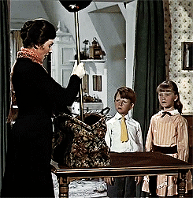
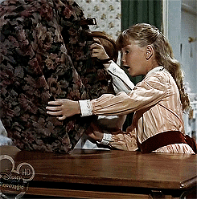
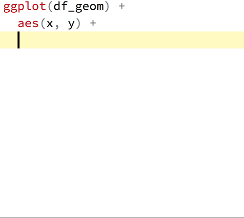
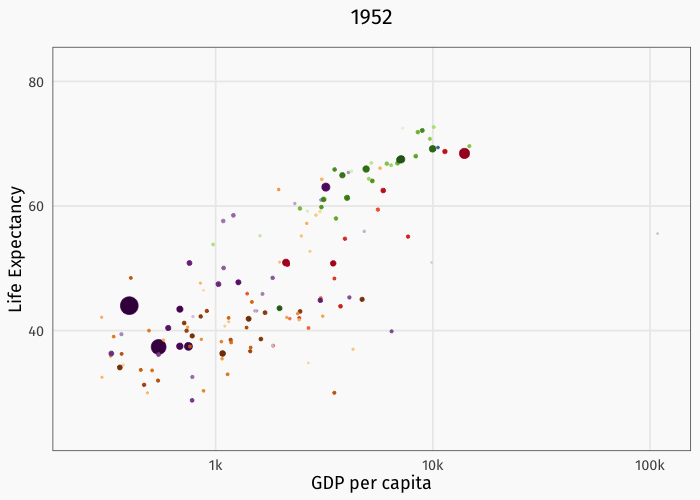
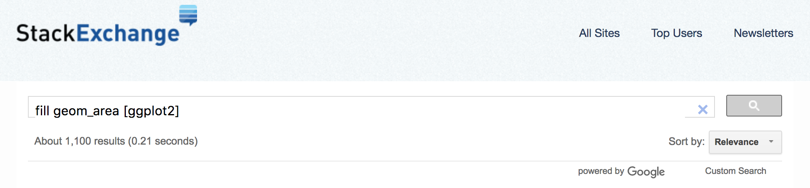
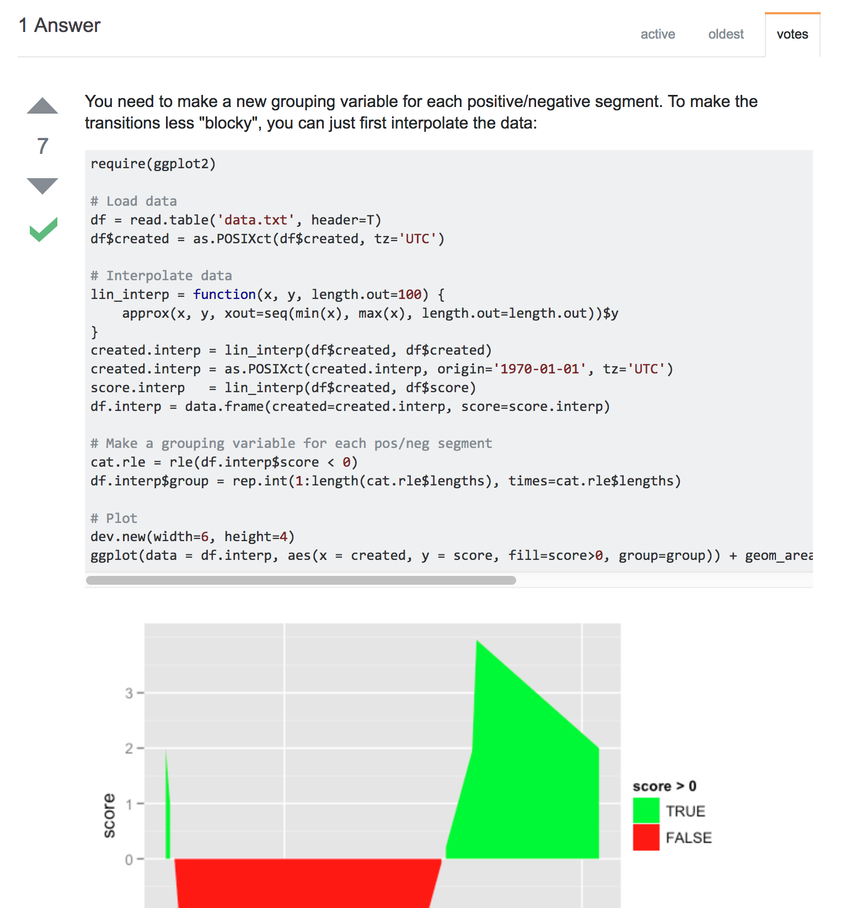
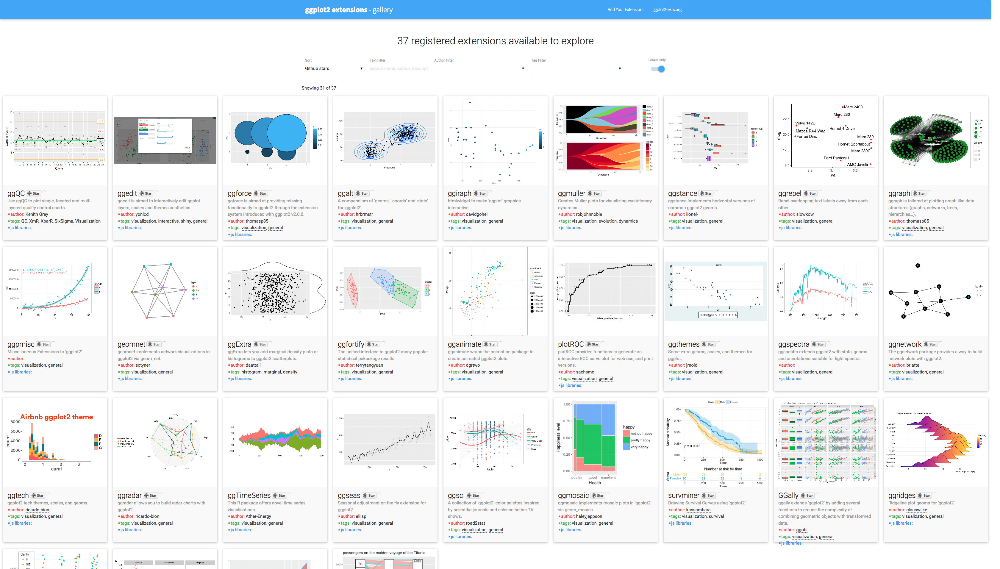

class: fullscreen, inverse, top, center, text-white
background-image: url("images/letter-g.jpg")

.font150[**Brought to you by the letter...**]

```{r setup, include=FALSE}
knitr::opts_chunk$set(fig.width=4.25, fig.height=3.5, fig.retina=3,
                      out.width = "100%",
                      message=FALSE, warning=FALSE, cache = TRUE, 
                      autodep = TRUE, hiline=TRUE)

knitr::opts_hooks$set(fig.callout = function(options) {
  if (options$fig.callout) {
    options$echo <- FALSE
    options$out.height <- "99%"
    options$fig.width <- 16
    options$fig.height <- 8
  }
  options
})

options(
  htmltools.dir.version = FALSE, 
  width = 90,
  max.print = 9999,
  knitr.table.format = "html"
)

as_table <- function(...) knitr::kable(..., format='html', digits = 3)
```

---
layout: true
# Why *ggplot2*?
---

.left-column[

__Hadley Wickham__
]

.right-column[.font150[
The transferrable skills from ggplot2 are not the idiosyncracies of plotting syntax, but a powerful way of thinking about visualisation, as a way of **mapping between variables and the visual properties of geometric objects** that you can perceive.
]
.footnote[<http://disq.us/p/sv640d>]
]


---

## My personal reasons

- .hl[Functional] data visualization

    1. Wrangle data
    2. Map data to visual elements
    3. Tweak scales, guides, axis, labels, theme

- Easy to .hl[reason] about how data drives visualization

- Easy to .hl[iterate]

- Easy to be .hl[consistent]

---
layout: false

# What are we getting into?

<br>
`ggplot2` is a huge package: philosophy + functions
<br>...but it's very well organized

--

<br><br>
*Lots* of examples of not-so-great plots in these slides
<br>...but that's okay

--

<br><br>
Going to throw a lot at you
<br>...but you'll know *where* and *what* to look for

--

.img-right[]

--

.img-right[]

---
layout: true
# G is for getting started

---


**Easy**: install the [tidyverse](http://tidyverse.org)

```r
install.packages('tidyverse')
```

**Medium**: install just `ggplot2`

```r
install.pacakages('ggplot2')
```

**Expert**: install from GitHub

```r
devtools::install_github('tidyverse/ggplot2')
```

---

## Load the tidyverse

```{r library-tidyverse, echo=TRUE, message=TRUE, warning=TRUE}
library(tidyverse)
```

---
## Other packages you'll need for this adventure

We'll use an excerpt of the [gapminder](http://www.gapminder.org/data/) dataset provided by the [`gapminder` package](https://github.com/jennybc/gapminder) by Jenny Bryan.

<https://github.com/jennybc/gapminder>

```{r library-extra, message=FALSE, eval=-1}
install.packages("gapminder")
library(gapminder)
```

---
layout: false
class: inverse center middle text-white

.font200[gg is for<br>Grammar of Graphics]

```{r guess-data-from-plot-og, echo=FALSE}
df_mpg <- mpg %>% 
  filter(class %in% c("compact", "suv")) %>% 
  filter(manufacturer %in% c("toyota", "ford", "audi")) %>% 
  filter(year == 2008) %>% 
  group_by(manufacturer, model) %>% 
  sample_n(1)

g <- ggplot(df_mpg) +
  aes(x = cty, y = hwy, color = class, shape = manufacturer) +
  geom_point(size = 4) +
  labs(x = NULL, y = NULL, shape = NULL, color = NULL) +
  theme_minimal() +
  theme(
    panel.grid = element_blank(),
    plot.background = element_rect(fill = rgb(250, 250, 250, max = 255),
                                   color = "#777777")
  )
```
---

# What is a grammar of graphics?

.left-code[
"Good grammar is just the first step in creating a good sentence."

#### How is the drawing on the right connected to data?

.footnote[<http://vita.had.co.nz/papers/layered-grammar.pdf>]
]

.right-plot[
```{r guess-data-from-plot-0, echo=FALSE}
g + 
  guides(color = FALSE, shape = FALSE) +
  theme(axis.text = element_blank())
```
]

---
layout: true
# Guess the data behind this plot?

.left-code[
### MPG Ratings of Cars

- Manufacturer
- Car Type (Class)
- City MPG
- Highway MPG
]

---

.right-plot[
```{r guess-data-from-plot-2, echo=FALSE}
g + guides(color = FALSE, shape = FALSE) +
  theme(axis.text = element_blank())
```
]

---

.right-plot[
```{r guess-data-from-plot-3, echo=FALSE}
g + guides(color = FALSE) +
  theme(axis.text = element_blank())
```
]

---

.right-plot[
```{r guess-data-from-plot-1, echo=FALSE}
g + 
  theme(axis.text = element_blank())
```
]

---

.right-plot[
```{r guess-data-from-plot-4, echo=FALSE}
g
```
]

---

.right-plot[
```{r guess-data-from-plot-5, echo=FALSE}
g + theme(panel.grid.major = element_line(color = "grey90"))
```
]

---

.right-plot[
```{r guess-data-from-plot-6, echo=FALSE}
g + 
  ggtitle("MPG Ratings") +
  labs(x = "City", y = "Highway", shape = "Manufacturer", color = "Class") +
  theme(
    panel.border = element_rect(fill = NA, color = "grey85"),
    panel.grid.major = element_line(color = "grey90")
  )
```
]

---

.right-plot[
```{r guess-data-from-plot-data, echo=FALSE, results='asis'}
df_mpg %>% 
  select(manufacturer, class, cty, hwy, model) %>% 
  knitr::kable()
```
]

---
layout: false
# How do we express visuals in words?

.font120[
- **Data** to be visualized
]

--
.font120[
- **.hlb[Geom]etric objects** that appear on the plot
]

--
.font120[
- **.hlb[Aes]thetic mappings** from data to visual component
]

--
.font120[
- **.hlb[Stat]istics** transform data on the way to visualization
]

--
.font120[
- **.hlb[Coord]inates** organize location of geometric objects
]

--
.font120[
- **.hlb[Scale]s** define the range of values for aesthetics
]

--
.font120[
- **.hlb[Facet]s** group into subplots
]


---
layout: true
# gg is for Grammar of Graphics

.left-column[
### Data

```r
ggplot(data)
```
]

---

.right-column[
#### Tidy Data

1. Each variable forms a .hl[column]

2. Each observation forms a .hl[row]

3. Each observational unit forms a table
]

--

.right-column[
#### Start by asking

1. What information do I want to use in my visualization?

1. Is that data contained in .hl[one column/row] for a given data point?
]

---

.right-column[
```{r tidy-messy1, results='asis', echo=FALSE}
pop_simple <- gapminder %>% 
  filter(
    country %in% c("Canada", "China", "United States"), 
    year >= 1997
  ) %>% 
  select(country, year, pop) %>% 
  mutate(pop = pop / 10^6)

messy_pop <- pop_simple %>% spread(year, pop)

knitr::kable(messy_pop, format = 'html')
```
]

--

.right-column[
```{r tidy-tidy1, result='asis', echo=-2}
tidy_pop <- gather(messy_pop, 'year', 'pop', -country)
as_table(tidy_pop)
```
]


---
layout: true
# gg is for Grammar of Graphics

.left-column[
### Data
### Aesthetics

```r
+ aes()
```

]
---

.right-column[
Map data to visual elements or parameters

- year

- pop

- country
]

---

.right-column[
Map data to visual elements or parameters

- year → **x**

- pop → **y**

- country → *shape*, *color*, etc.
]

---

.right-column[
Map data to visual elements or parameters

```r
aes(
  x = year,
  y = pop,
  color = country
)
```
]

---
layout: true
# gg is for Grammar of Graphics

.left-column[
### Data
### Aesthetics
### Geoms

```r
+ geom_*()
```
]

---

.right-column[
Geometric objects displayed on the plot

```{r geom_demo, echo=FALSE, fig.width=6, out.width="650px"}
minimal_theme <- theme_bw() +
  theme(
    axis.text = element_blank(),
    axis.ticks = element_blank(),
    panel.grid = element_blank(),
    panel.border = element_blank(),
    axis.title = element_blank(),
    plot.title = element_text(hjust = 0.5),
    text = element_text(family = "Fira Mono"),
    plot.background = element_rect(fill = "#FAFAFA", color = NA),
    panel.background = element_rect(fill = "#FAFAFA", color = NA)
  )

set.seed(4242)
df_geom <- data_frame(y = rnorm(10), x = 1:10)

g_geom <- list()
g_geom$point <- ggplot(df_geom, aes(x, y)) + geom_point() + ggtitle("geom_point()")
g_geom$line <- ggplot(df_geom, aes(x, y)) + geom_line() + ggtitle("geom_line()")
g_geom$bar <- ggplot(df_geom, aes(x, y)) + geom_col() + ggtitle("geom_col()")
g_geom$boxplot <- ggplot(df_geom, aes(y = y)) + geom_boxplot() + ggtitle("geom_boxplot()")
g_geom$histogram <- ggplot(df_geom, aes(y)) + geom_histogram(binwidth = 1) + ggtitle("geom_histogram()")
g_geom$density <- ggplot(df_geom, aes(y)) + geom_density(fill = "grey40", alpha = 0.25) + ggtitle("geom_density()") + xlim(-4, 4)

g_geom <- map(g_geom, ~ . + minimal_theme)

cowplot::plot_grid(plotlist = g_geom)
```
]

---

.right-column[
Here are the [some of the most widely used geoms](https://eric.netlify.com/2017/08/10/most-popular-ggplot2-geoms/)

.font70.center[
| Type | Function |
|:----:|:--------:|
| Point | `geom_point()` |
| Line | `geom_line()` |
| Bar | `geom_bar()`, `geom_col()` |
| Histogram | `geom_histogram()` |
| Regression | `geom_smooth()` |
| Boxplot | `geom_boxplot()` |
| Text | `geom_text()` |
| Vert./Horiz. Line | `geom_{vh}line()` |
| Count | `geom_count()` |
| Density | `geom_density()` |

<https://eric.netlify.com/2017/08/10/most-popular-ggplot2-geoms/>
]
]


---

.right-column[

See <http://ggplot2.tidyverse.org/reference/> for many more options

.font70[
```{r ggplot2-geom-names, echo=FALSE}
# geom_
old_width = options(width = 80)
lsf.str("package:ggplot2") %>% grep("^geom_", ., value = TRUE)
options(width = old_width$width)
```
]
]
--

.right-column[

Or just start typing `geom_` in RStudio
]


---
layout: true
# Our first plot!
---

.left-code[
```{r first-plot1a, eval=FALSE}
ggplot(tidy_pop)
```
]

.right-plot[
```{r first-plot1a-out, ref.label='first-plot1a', echo=FALSE, out.width="100%"}
```
]

---

.left-code[
```{r first-plot1b, eval=FALSE}
ggplot(tidy_pop) +
  aes(x = year, #<<
      y = pop) #<<
```
]

.right-plot[
```{r first-plot1b-out, ref.label='first-plot1b', echo=FALSE, out.width="100%"}
```
]

---

.left-code[
```{r first-plot1c, eval=FALSE}
ggplot(tidy_pop) +
  aes(x = year,
      y = pop) +
  geom_point() #<<
```
]

.right-plot[
```{r first-plot1c-out, ref.label='first-plot1c', echo=FALSE, out.width="100%"}
```
]

---

.left-code[
```{r first-plot1, eval=FALSE}
ggplot(tidy_pop) +
  aes(x = year,
      y = pop,
      color = country) + #<<
  geom_point()
```
]

.right-plot[
```{r first-plot1-out, ref.label='first-plot1', echo=FALSE, out.width="100%"}
```
]

---

.left-code[
```{r first-plot2-fake, eval=FALSE}
ggplot(tidy_pop) +
  aes(x = year,
      y = pop,
      color = country) +
  geom_point() +
  geom_line() #<<
```

.font80[
```r
geom_path: Each group consists
of only one observation. 
Do you need to adjust the 
group aesthetic?
```
]
]

.right-plot[
```{r first-plot2-fake-out, ref.label='first-plot2-fake', echo=FALSE, out.width="100%"}
```
]
---

.left-code[
```{r first-plot2, eval=FALSE}
ggplot(tidy_pop) +
  aes(x = year,
      y = pop,
      color = country) +
  geom_point() +
  geom_line(
    aes(group = country)) #<<
```
]

.right-plot[
```{r first-plot2-out, ref.label='first-plot2', echo=FALSE, out.width="100%"}
```
]

---


.left-code[
```{r first-plot3, eval=FALSE}
g <- ggplot(tidy_pop) +
  aes(x = year,
      y = pop,
      color = country) +
  geom_point() +
  geom_line(
    aes(group = country))

g
```
]

.right-plot[
```{r first-plot3-out, ref.label='first-plot2', echo=FALSE, out.width="100%"}
```
]

---
layout: true
# gg is for Grammar of Graphics

.left-column[
### Data
### Aesthetics
### Geoms

```r
+ geom_*()
```
]
---

.right-column[
```r
geom_*(mapping, data, stat, position)
```

- `data` Geoms can have their own data
    - Has to map onto global coordinates

- `map` Geoms can have their own aesthetics
    - Inherits global aesthetics
    - Have geom-specific aesthetics
        - `geom_point` needs `x` and `y`, optional `shape`, `color`, `size`, etc.
        - `geom_ribbon` requires `x`, `ymin` and `ymax`, optional `fill`
    - `?geom_ribbon`
]

---

.right-column[
```r
geom_*(mapping, data, stat, position)
```

- `stat` Some geoms apply further transformations to the data
    - All respect `stat = 'identity'`
    - Ex: `geom_histogram` uses `stat_bin()` to group observations
    
- `position` Some adjust location of objects
    - `'dodge'`, `'stack'`, `'jitter'`
]

---
layout: true
# gg is for Grammar of Graphics

.left-column[
### Data
### Aesthetics
### Geoms
### Facet

```r
+facet_wrap() 

+facet_grid()
```
]
---

```{r geom_facet_setup, include=FALSE}
tidy_pop <- left_join(tidy_pop, select(gapminder, country, continent))

g <- ggplot(tidy_pop) +
  aes(x = year,
      y = pop,
      color = country) +
  geom_point() +
  geom_line(aes(group = country))
```

.right-column[
```{r geom_facet, echo=TRUE, out.width="90%", fig.width=6}
g + facet_wrap(~ country)
```
]

---

.right-column[
```{r geom_grid, echo=TRUE, out.width="90%", fig.width=6}
g + facet_grid(continent ~ country)
```
]

---
layout: true
# gg is for Grammar of Graphics

.left-column[
### Data
### Aesthetics
### Geoms
### Facet
### Labels

```r
+ labs()
```
]
---

.right-column[
```{r labs-ex, echo=TRUE, out.width="90%", fig.width=6}
g + labs(x = "Year", y = "Population")
```
]

---
layout: true
# gg is for Grammar of Graphics

.left-column[
### Data
### Aesthetics
### Geoms
### Facet
### Labels
### Coords

```r
+ coord_*()
```
]
---

.right-column[
```{r coord-ex, echo=TRUE, out.width="90%", fig.width=6}
g + coord_flip()
```
]

---

.right-column[
```{r coord-ex2, echo=TRUE, out.width="90%", fig.width=6}
g + coord_polar()
```
]

---
layout: true
# gg is for Grammar of Graphics

.left-column[
### Data
### Aesthetics
### Geoms
### Facet
### Labels
### Coords
### Scales

```r
+ scale_*_*()
```
]
---

.right-column[ 
`scale` + `_` + `<aes>` + `_` + `<type>` + `()`

What parameter do you want to adjust? → `<aes>` <br>
What type is the parameter? → `<type>`

- I want to change my discrete x-axis<br>`scale_x_discrete()`
- I want to change range of point sizes from continuous variable<br>`scale_size_continuous()`
- I want to rescale y-axis as log<br>`scale_y_log10()`
- I want to use a different color palette<br>`scale_fill_discrete()`<br>`scale_color_manual()`
]

---

.right-column[
```{r scale_ex1, out.width="90%", fig.width=6}
g + scale_color_manual(values = c("peru", "pink", "plum"))
```
]

---

.right-column[
```{r scale_ex2, out.width="90%", fig.width=6}
g + scale_y_log10()
```
]

---

.right-column[
```{r scale_ex4, out.width="90%", fig.width=6}
g + scale_x_discrete(labels = c("MCMXCVII", "MMII", "MMVII"))
```
]

---
layout: true
# gg is for Grammar of Graphics

.left-column[
### Data
### Aesthetics
### Geoms
### Facet
### Labels
### Coords
### Scales
### Theme

```r
+ theme()
```
]

---

.right-column[
Change the appearance of plot decorations<br>
i.e. things that aren't mapped to data

A few "starter" themes ship with the package

- `g + theme_bw()`
- `g + theme_dark()`
- `g + theme_gray()`
- `g + theme_light()`
- `g + theme_minimal()`

]

---

.right-column[
Huge number of parameters, grouped by plot area:

- Global options: `line`, `rect`, `text`, `title`
- `axis`: x-, y- or other axis title, ticks, lines
- `legend`: Plot legends
- `panel`: Actual plot area
- `plot`: Whole image
- `strip`: Facet labels
]
---

.right-column[
Theme options are supported by helper functions:

- `element_blank()` removes the element
- `element_line()`
- `element_rect()`
- `element_text()`
]

---

.right-column[
```{r, out.width="90%", fig.width=6}
g + theme_bw()
```
]

---

.right-column[
.font80[
```{r, out.width="90%", fig.width=6}
g + theme_minimal() + theme(text = element_text(family = "Palatino"))
```
]
]

---

.right-column[
You can also set the theme globally with `theme_set()`

```{r theme_set}
my_theme <- theme_bw() +
  theme(
    text = element_text(family = "Palatino", size = 12),
    panel.border = element_rect(colour = 'grey80'), 
    panel.grid.minor = element_blank()
  )

theme_set(my_theme)
```

All plots will now use this theme!
]

---

.right-column[
```{r, out.width="90%", fig.width=6, dependson='theme_set'}
g
```
]

---

.right-column[
```{r, out.width="90%", fig.width=6, dependson='theme_set'}
g + theme(legend.position = 'bottom')
```
]

---
layout: false
# Save Your Work

To save your plot, use **ggsave**

```{r ggsave, eval=FALSE}
ggsave(
  filename = "my_plot.png",
  plot = my_plot,
  width = 10,
  height = 8,
  dpi = 100,
  device = "png"
)
```

---
layout: false
count: hide
class: fullscreen, inverse, top, left, text-white
background-image: url(images/super-grover.jpg)

.font200[You have the power!]
---

class: inverse, center, middle

# "Live" Coding

```{r}
library(gapminder)
```

```{r reset_theme, include=FALSE}
theme_set(theme_gray())
```

---
# head(gapminder)

```{r head-gapminder, echo=FALSE}
head(gapminder)
```

---
# glimpse(gapminder)

```{r summary-gapminder, echo=FALSE, comment=""}
glimpse(gapminder)
```

--

Let's start with `lifeExp` vs `gdpPercap`

---
class: fullscreen
layout: true
---

.left-code[
```{r gapminder-le-gdp-1, fig.show="hide"}
ggplot(gapminder) +
  aes(x = gdpPercap,
      y = lifeExp)
```
]

.right-plot[
`)
]

--

Add points...

---

.left-code[
```{r gapminder-le-gdp-2, fig.show="hide"}
ggplot(gapminder) +
  aes(x = gdpPercap,
      y = lifeExp) +
  geom_point() #<<
```
]

.right-plot[
`)
]

--

How can I tell countries apart?

---

.left-code[
```{r gapminder-le-gdp-3, fig.show="hide"}
ggplot(gapminder) +
  aes(x = gdpPercap,
      y = lifeExp,
      color = continent) + #<<
  geom_point()
```
]

.right-plot[
`)
]

--

GDP is squished together on the left

---

.left-code[
```{r gapminder-le-gdp-4, fig.show="hide"}
ggplot(gapminder) +
  aes(x = gdpPercap,
      y = lifeExp,
      color = continent) +
  geom_point() +
  scale_x_log10() #<<
```
]

.right-plot[
`)
]

--

Still lots of overlap in the countries...

---

.left-code[
```{r gapminder-le-gdp-5, fig.show="hide"}
ggplot(gapminder) +
  aes(x = gdpPercap,
      y = lifeExp,
      color = continent) +
  geom_point() +
  scale_x_log10() +
  facet_wrap(~ continent) + #<<
  guides(color = FALSE)     #<<
```

No need for color legend thanks to facet titles
]

.right-plot[
`)
]

--

Lots of overplotting due to point size

---

.left-code[
```{r gapminder-le-gdp-6, fig.show="hide"}
ggplot(gapminder) +
  aes(x = gdpPercap,
      y = lifeExp,
      color = continent) +
  geom_point(size = 0.25) + #<<
  scale_x_log10() +
  facet_wrap(~ continent) +
  guides(color = FALSE)
```
]

.right-plot[
`)
]

--

Is there a trend?

---

.left-code[
```{r gapminder-le-gdp-7, fig.show="hide"}
ggplot(gapminder) +
  aes(x = gdpPercap,
      y = lifeExp,
      color = continent) +
  geom_line() + #<<
  geom_point(size = 0.25) +
  scale_x_log10() +
  facet_wrap(~ continent) +
  guides(color = FALSE)
```
]

.right-plot[
`)
]

--

Okay, that line just connected all of the points sequentially...

---

.left-code[
```{r gapminder-le-gdp-8, fig.show="hide"}
ggplot(gapminder) +
  aes(x = gdpPercap,
      y = lifeExp,
      color = continent) +
  geom_line(
    aes(group = country) #<<
  ) +
  geom_point(size = 0.25) +
  scale_x_log10() +
  facet_wrap(~ continent) +
  guides(color = FALSE)
```

.font200.center[&#x1F914;]
]

.right-plot[
`)
]

--

&#x1F4A1; We need time on x-axis!

---

.left-code[
```{r gapminder-gdp-year-1, fig.show="hide"}
ggplot(gapminder) +
  aes(x = year, #<<
      y = gdpPercap, #<<
      color = continent) +
  geom_line(
    aes(group = country)
  ) +
  geom_point(size = 0.25) +
  scale_y_log10() + #<<
  facet_wrap(~ continent) +
  guides(color = FALSE)
```
]

.right-plot[
`)
]

--

Can't see x-axis labels, though

---

.left-code[
```{r gapminder-gdp-year-2, fig.show="hide"}
ggplot(gapminder) +
  aes(x = year,
      y = gdpPercap,
      color = continent) +
  geom_line(
    aes(group = country)
  ) +
  geom_point(size = 0.25) +
  scale_y_log10() +
  scale_x_continuous(breaks = #<<
    seq(1950, 2000, 25) #<<
  ) +                            #<<
  facet_wrap(~ continent) +
  guides(color = FALSE)
```
]

.right-plot[
`)
]

--

What about life expectancy?

---

.left-code[
```{r gapminder-le-year-1, fig.show="hide"}
ggplot(gapminder) +
  aes(x = year, 
      y = lifeExp, #<<
      color = continent) +
  geom_line(
    aes(group = country)
  ) +
  geom_point(size = 0.25) +
  #scale_y_log10() + #<<
  scale_x_continuous(breaks = 
    seq(1950, 2000, 25)
  ) +  
  facet_wrap(~ continent) +
  guides(color = FALSE)
```
]

.right-plot[
`)
]

--

Okay, let's add a trend line

---

.left-code[
```{r gapminder-le-year-2, fig.show="hide"}
ggplot(gapminder) +
  aes(x = year, 
      y = lifeExp,
      color = continent) +
  geom_line(
    aes(group = country)
  ) +
  geom_point(size = 0.25) +
  geom_smooth() + #<<
  scale_x_continuous(breaks = 
    seq(1950, 2000, 25)
  ) +  
  facet_wrap(~ continent) +
  guides(color = FALSE)
```
]

.right-plot[
`)
]

--

De-emphasize individual countries

---

.left-code[
```{r gapminder-le-year-3, fig.show="hide"}
ggplot(gapminder) +
  aes(x = year, 
      y = lifeExp,
      color = continent) +
  geom_line(
    aes(group = country),
    color = "grey75" #<<
  ) +
  geom_point(size = 0.25) +
  geom_smooth() + 
  scale_x_continuous(breaks = 
    seq(1950, 2000, 25)
  ) +  
  facet_wrap(~ continent) +
  guides(color = FALSE)
```
]

.right-plot[
`)
]

--

Points are still in the way

---

.left-code[
```{r gapminder-le-year-4, fig.show="hide"}
ggplot(gapminder) +
  aes(x = year, 
      y = lifeExp,
      color = continent) +
  geom_line(
    aes(group = country),
    color = "grey75"
  ) +
  #geom_point(size = 0.25) + #<<
  geom_smooth() + 
  scale_x_continuous(breaks = 
    seq(1950, 2000, 25)
  ) +  
  facet_wrap(~ continent) +
  guides(color = FALSE)
```
]

.right-plot[
`)
]

--

Let's compare continents

---

.left-code[
```{r gapminder-le-year-5, fig.show="hide"}
ggplot(gapminder) +
  aes(x = year, 
      y = lifeExp,
      color = continent) +
  geom_line(
    aes(group = country),
    color = "grey75"
  ) +
  geom_smooth() + 
  # scale_x_continuous(
  #   breaks = 
  #     seq(1950, 2000, 25)
  # ) +  
  # facet_wrap(~ continent) + #<<
  guides(color = FALSE)
```
]

.right-plot[
`)
]

--

Wait, what color is each continent?

---

.left-code[
```{r gapminder-le-year-6, fig.show="hide"}
ggplot(gapminder) +
  aes(x = year, 
      y = lifeExp,
      color = continent) +
  geom_line(
    aes(group = country),
    color = "grey75"
  ) +
  geom_smooth() + 
  theme( #<<
  legend.position = "bottom" #<<
  ) #<<
```
]

.right-plot[
`)
]

--

Let's try the minimal theme

---

.left-code[
```{r gapminder-le-year-7, fig.show="hide"}
ggplot(gapminder) +
  aes(x = year, 
      y = lifeExp,
      color = continent) +
  geom_line(
    aes(group = country),
    color = "grey75"
  ) +
  geom_smooth() + 
  theme_minimal() + #<<
  theme(
  legend.position = "bottom"
  )
```
]

.right-plot[
`)
]

--

Fonts are kind of big

---

.left-code[
```{r gapminder-le-year-8, fig.show="hide"}
ggplot(gapminder) +
  aes(x = year, 
      y = lifeExp,
      color = continent) +
  geom_line(
    aes(group = country),
    color = "grey75"
  ) +
  geom_smooth() + 
  theme_minimal( 
    base_size = 8) + #<<
  theme(
  legend.position = "bottom"
  )
```
]

.right-plot[
`)
]

--

Cool, let's switch gears

---

.left-code[
```{r gapminder-americas-data, fig.show="hide"}
americas <- 
  gapminder %>% 
  filter(
    country %in% c(
      "United States",
      "Canada",
      "Mexico",
      "Ecuador"
    )
  )
```

Let's look at four countries in more detail. How do their populations compare to each other?
]

.right-plot[
<!-- `) -->
```{r echo=FALSE}
americas
```
]

---

.left-code[
```{r gapminder-americas-1, fig.show="hide"}
ggplot(americas) +
  aes(
    x = year,
    y = pop
  ) +
  geom_col()
```
]

.right-plot[
`)
]

--

Yeah, but how many people are in each country?

---

.left-code[
```{r gapminder-americas-2, fig.show="hide"}
ggplot(americas) +
  aes(
    x = year,
    y = pop,
    fill = country #<<
  ) +
  geom_col()
```
]

.right-plot[
`)
]

--

Bars are "stacked", can we separate?

---

.left-code[
```{r gapminder-americas-3, fig.show="hide"}
ggplot(americas) +
  aes(
    x = year,
    y = pop,
    fill = country
  ) +
  geom_col(
    position = "dodge" #<<
  )
```

`position = "dodge"` places objects _next to each other_ instead of overlapping
]

.right-plot[
`)
]

--

&#x1F913; What is scientific notation anyway?

---

.left-code[
```{r gapminder-americas-4, fig.show="hide"}
ggplot(americas) +
  aes(
    x = year,
    y = pop / 10^6, #<<
    fill = country
  ) +
  geom_col(
    position = "dodge" 
  )
```

ggplot aesthetics can take expressions!
]

.right-plot[
`)
]

--

Might be easier to see countries individually

---

.left-code[
```{r gapminder-americas-5, fig.show="hide"}
ggplot(americas) +
  aes(
    x = year,
    y = pop / 10^6,
    fill = country
  ) +
  geom_col(
    position = "dodge" 
  ) +
  facet_wrap(~ country) + #<<
  guides(fill = FALSE) #<<
```
]

.right-plot[
`)
]

--

Let range of y-axis vary in each plot

---

.left-code[
```{r gapminder-americas-6, fig.show="hide"}
ggplot(americas) +
  aes(
    x = year,
    y = pop / 10^6,
    fill = country
  ) +
  geom_col(
    position = "dodge" 
  ) +
  facet_wrap(~ country,
    scales = "free_y") + #<<
  guides(fill = FALSE)
```
]

.right-plot[
`)
]

--

What about life expectancy again?

---

.left-code[
```{r gapminder-americas-7, fig.show="hide"}
ggplot(americas) +
  aes(
    x = year,
    y = lifeExp, #<<
    fill = country
  ) +
  geom_col(
    position = "dodge" 
  ) +
  facet_wrap(~ country,
    scales = "free_y") +
  guides(fill = FALSE)
```
]

.right-plot[
`)
]

--

This should really be &#x1F4C8; instead of &#x1F4CA;

---

.left-code[
```{r gapminder-americas-8, fig.show="hide"}
ggplot(americas) +
  aes(
    x = year,
    y = lifeExp,
    fill = country
  ) +
  geom_line() + #<<
  facet_wrap(~ country,
    scales = "free_y") +
  guides(fill = FALSE)
```
]

.right-plot[
`)
]

--

&#x1F4CA; are **fill**ed, &#x1F4C8; are **color**ed

---

.left-code[
```{r gapminder-americas-9, fig.show="hide"}
ggplot(americas) +
  aes(
    x = year,
    y = lifeExp,
    color = country #<<
  ) +
  geom_line() +
  facet_wrap(~ country,
    scales = "free_y") +
  guides(color = FALSE) #<<
```
]

.right-plot[
`)
]

--

Altogether now!

---

.left-code[
```{r gapminder-americas-10, fig.show="hide"}
ggplot(americas) +
  aes(
    x = year,
    y = lifeExp,
    color = country
  ) +
  geom_line()
```
]

.right-plot[
`)
]

--

Okay, changing gears again. What is range of life expectancy in Americas?

---

.left-code[
```{r gapminder-all-americas-1, fig.show="hide"}
gapminder %>% 
  filter(
    continent == "Americas"
  ) %>% #<<
  ggplot() + #<<
  aes(
    x = year,
    y = lifeExp
  )
```

You can pipe into `ggplot()`!  
Just watch for `%>%` changing to `+`
]

.right-plot[
`)
]

--

Boxplot for life expectancy range

---

.left-code[
```{r gapminder-all-americas-2, fig.show="hide"}
gapminder %>% 
  filter(
    continent == "Americas"
  ) %>%
  ggplot() +
  aes(
    x = year,
    y = lifeExp
  ) +
  geom_boxplot() #<<
```
]

.right-plot[
`)
]

--

Why not boxplots by year?

---

.left-code[
```{r gapminder-all-americas-3, fig.show="hide"}
gapminder %>% 
  filter(
    continent == "Americas"
  ) %>%
  mutate( #<<
    year = factor(year) #<<
  ) %>%  #<<
  ggplot() +
  aes(
    x = year,
    y = lifeExp
  ) +
  geom_boxplot()
```
]

.right-plot[
`)
]

--

OK, what about global life expectancy?

---

.left-code[
```{r gapminder-all-americas-4, fig.show="hide"}
gapminder %>% 
  # filter(
  #   continent == "Americas"
  # ) %>%
  mutate(
    year = factor(year)
  ) %>% 
  ggplot() +
  aes(
    x = year,
    y = lifeExp
  ) +
  geom_boxplot()
```
]

.right-plot[
`)
]

--

Can we have cute little boxplots for each continent?

---

.left-code[
```{r gapminder-all-americas-5, fig.show="hide"}
gapminder %>% 
  mutate(
    year = factor(year)
  ) %>% 
  ggplot() +
  aes(
    x = year,
    y = lifeExp,
    fill = continent #<<
  ) +
  geom_boxplot()
```
]

.right-plot[
`)
]

--

Hard to read years, let's rotate &#x1F504;

---

.left-code[
```{r gapminder-all-americas-6, fig.show="hide"}
gapminder %>% 
  mutate(
    year = factor(year)
  ) %>% 
  ggplot() +
  aes(
    x = year,
    y = lifeExp,
    fill = continent
  ) +
  geom_boxplot() +
  coord_flip() #<<
```
]

.right-plot[
`)
]

--

Use `dplyr` to group by decade

---

.left-code[
```{r gapminder-all-americas-7, fig.show="hide"}
gapminder %>% 
  mutate(
    decade = floor(year / 10), #<<
    decade = decade * 10,      #<<
    decade = factor(decade)      #<<
  ) %>% 
  ggplot() +
  aes(
    x = decade, #<<
    y = lifeExp,
    fill = continent
  ) +
  geom_boxplot() +
  coord_flip()
```
]

.right-plot[
`)
]

--

Let's hide Oceania, sorry &#x1F1E6;&#x1F1FA;&#x1F1F3;&#x1F1FF;&#x1F1EE;&#x1F1E9;&#x1F1EB;&#x1F1EF;&#x1F1F5;&#x1F1EC;

---

.left-code[
```{r gapminder-all-americas-8, fig.show="hide", echo=1}
g <- gapminder %>% 
  filter( #<<
    continent != "Oceania" #<<
  ) %>% #<<
  mutate(
    decade = floor(year / 10) * 10, decade = factor(decade)      
  ) %>% 
  ggplot() +
  aes(
    x = decade,
    y = lifeExp,
    fill = continent
  ) +
  geom_boxplot() +
  coord_flip()

g
```
]

.right-plot[
`)
]

---

.left-code[
```{r gapminder-all-americas-9, fig.show="hide", echo=1}
g +
  theme_minimal(8) +
  labs(
    y = "Life Expectancy",
    x = "Decade",
    fill = NULL,
    title = "Life Expectancy by Continent and Decade",
    caption = "gapminder.org"
  )
```

Note `x` and `y` are _original_ aesthetics, `coord_flip()` happens _after_.  

Remove labels by setting `= NULL`.
]

.right-plot[
`)
]

---
layout: false
class: inverse, center, middle

# Level up

```r
Inspired by "The Best Stats You've Ever Seen" by Hans Rosling

http://www.ted.com/talks/hans_rosling_shows_the_best_stats_you_ve_ever_seen
```

---
# Create the initial layout

```{r hans-rosling-1, echo=1, out.height="99%", fig.width=16, fig.height=8, fig.show="hide"}
g_hr <- 
  ggplot(gapminder) +
  aes(x = gdpPercap, y = lifeExp, size = pop, color = country) +
  geom_point() +
  facet_wrap(~year)
g_hr
```

.plot-callout[
`)
]

---
# Hide the guides

```{r hans-rosling-1a, echo=1, out.height="99%", fig.width=16, fig.height=8, fig.show="hide"}
g_hr <- 
  ggplot(gapminder) +
  aes(x = gdpPercap, y = lifeExp, size = pop, color = country) +
  geom_point() +
  facet_wrap(~year) +
  guides(color = FALSE, size = FALSE)
g_hr
```

.plot-callout[
`)
]

---
# Adjust scales of x-axis, color, and size

```{r hans-rosling-2, echo=1, out.height="99%", fig.width=16, fig.height=8, fig.show="hide"}
g_hr <- 
  g_hr +
  scale_x_log10(breaks = c(10^3, 10^4, 10^5), labels = c("1k", "10k", "100k")) +
  scale_color_manual(values = gapminder::country_colors) +
  scale_size(range = c(0.5, 12))
  
g_hr
```

.plot-callout[
`)
]

---
# Tweak Anotations

<br><br>

```{r hans-rosling-3, echo=1, out.height="99%", fig.width=16, fig.height=8, fig.show="hide"}
g_hr <- 
  g_hr +
  labs(
    x = "GDP per capita",
    y = "Life Expectancy"
  ) +
  theme_minimal(base_family = "Fira Sans") +
  theme(
    strip.text = element_text(size = 16, face = "bold"),
    panel.border = element_rect(fill = NA, color = "grey40"),
    panel.grid.minor = element_blank()
  )
g_hr
```

.plot-callout.top-right[
`)
]

---
# The final code and plot

.font70[
```{r hans-rosling-final, fig.width=16, fig.height=9, fig.show="hide"}
ggplot(gapminder) +
  aes(x = gdpPercap, y = lifeExp, size = pop, color = country) +
  geom_point() +
  facet_wrap(~year) +
  guides(color = FALSE, size = FALSE) +
  scale_x_log10(
    breaks = c(10^3, 10^4, 10^5), 
    labels = c("1k", "10k", "100k")) +
  scale_color_manual(values = gapminder::country_colors) +
  scale_size(range = c(0.5, 12)) +
  labs(
    x = "GDP per capita",
    y = "Life Expectancy") +
  theme_minimal(14, base_family = "Fira Sans") +
  theme(
    strip.text = element_text(size = 16, face = "bold"),
    panel.border = element_rect(fill = NA, color = "grey40"),
    panel.grid.minor = element_blank())
```
]

---
class: fullscreen
background-image: url(`r knitr::fig_chunk("hans-rosling-final", "png")`)
background-size: cover

---
# Special Bonus: Animated!

.left-code[
```{r include=FALSE}
library(gganimate)
g_hra <- 
  ggplot(gapminder) +
  aes(x = gdpPercap, y = lifeExp, size = pop, color = country) +
  geom_point() +
  guides(color = FALSE, size = FALSE) +
  scale_x_log10(
    breaks = c(10^3, 10^4, 10^5), 
    labels = c("1k", "10k", "100k")) +
  scale_color_manual(values = gapminder::country_colors) +
  scale_size(range = c(0.5, 12)) +
  labs(
    x = "GDP per capita",
    y = "Life Expectancy") +
  theme_minimal(18, base_family = "Fira Sans") +
  theme(
    plot.background = element_rect("#FAFAFA", color = NA),
    strip.text = element_text(size = 16, face = "bold"),
    panel.border = element_rect(fill = NA, color = "grey40"),
    panel.grid.minor = element_blank(),
    plot.title = element_text(hjust = 0.5)
  ) + 
  transition_states(
    year, 1, 0
  ) + 
  ggtitle("{closest_state}")

anim_save("images/hans-rosling-esque.gif", 
          animate(g_hra, width = 700, height = 500))
```

.font70[
```{r hans-rosling-animated, eval=FALSE}
# library(devtools)
# install_github("thomasp85/gganimate")
library(gganimate)

# Same plot without facet_wrap()
g_hra + 
  transition_states(year, 1, 0) + 
  ggtitle("{closest_state}")
```
]
]

--

.right-plot[

]


---
layout: false
class: inverse, middle, center

# g is for Goodbye
---
layout: true
# Stack Exchange is Awesome
---



---



---
layout: false

# ggplot2 Extensions: exts.ggplot2.tidyverse.org/gallery



---
# ggplot2 and beyond

### Learn more

- **ggplot2 docs:** <http://ggplot2.tidyverse.org/>

- **R4DS - Data visualization:** <http://r4ds.had.co.nz/data-visualisation.html>

- **Hadley Wickham's ggplot2 book:** <https://www.amazon.com/dp/0387981403/>

### Noteworthy RStudio Add-Ins

- [esquisse](https://github.com/dreamRs/esquisse): Interactively build ggplot2 plots

- [ggplotThemeAssist](https://github.com/calligross/ggthemeassist): Customize your ggplot theme interactively

- [ggedit](https://github.com/metrumresearchgroup/ggedit): Layer, scale, and theme editing

---

# Practice and Review

### #TidyTuesday

- <https://github.com/rfordatascience/tidytuesday>

### Fun Datasets

- `fivethirtyeight`

- `nycflights`

- `ggplot2movies`

### Review

- Slides and code on GitHub: <http://github.com/gadenbuie/gentle-ggplot2>

---
class: inverse, center, middle

# Thanks!

.font150.text-white[
@grrrck <br>
github.com/gadenbuie <br>
Garrick Aden-Buie
]
