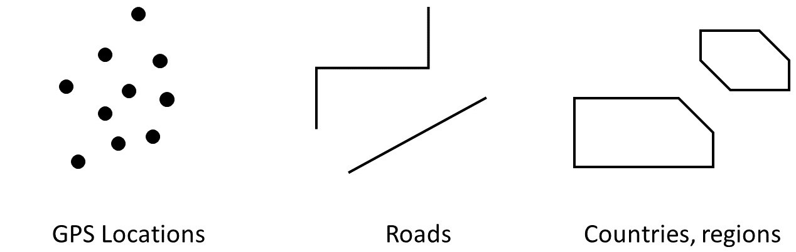
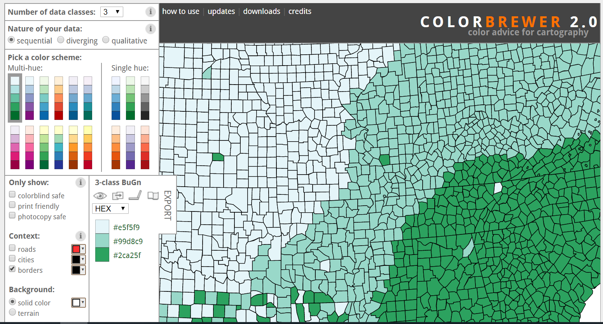

layout: false
class: inverse center middle text-white

.font200[Introduction to leaflet]

```{r setup, include=FALSE}
knitr::opts_chunk$set(fig.width=5, fig.height=6, fig.retina=3,
                      out.width = "100%",
                      message=FALSE, warning=FALSE, cache = TRUE, 
                      autodep = TRUE, hiline=TRUE)

knitr::opts_hooks$set(fig.callout = function(options) {
  if (options$fig.callout) {
    options$echo <- FALSE
    options$out.height <- "99%"
    options$fig.width <- 14
    options$fig.height <- 16
  }
  options
})

options(
  htmltools.dir.version = FALSE, 
  width = 90,
  max.print = 9999,
  knitr.table.format = "html"
)

as_table <- function(...) knitr::kable(..., format='html', digits = 3)
```

---
layout: true
# What we'll cover today.
---

- Intro to the `sf` packages

--

- Building a map using `ggplot2`

--

- Coordinate Systems and geospatial objects in R

--

- Building interactives maps using `leaflet`. 

---
layout: true
# Packages for today's adventure
---

```{r}
library(tidyverse) ## For plotting and data wrangling.

library(leaflet) ## For leaflet interactive maps

library(sf) ## For spatial data

library(RColorBrewer) ## For colour palettes

library(htmltools) ## For html

library(leafsync) ## For placing plots side by side

```


---

layout: false
class: inverse center middle text-white

.font200[Introduction to the sf package]

---
layout: false

# The sf package

* Package for geospatial data manipulation and analysis that works with features
  * **points** (POINT, MULTIPOINT)
  * **lines** (LINESTRING, MULTILINESTRING)
  * **polygons** (POLYGON, MULTIPOLYGON)
  



---
layout: true
# Birth Rates in North Carolina
---

* We will use the North Carolina (`nc`) data from the `sf` package.

--

* Let's load in the data for North Carolina using the function `st_read`.

--

```{r nc-data, eval = TRUE, messages = FALSE}

nc_df <- st_read(system.file("shape/nc.shp", package="sf"))

```

* `st` = spatial type and `.shp` is a common shape file format (e.g. GIS). 

--

---
layout: true
# Rename the columns and view the data North Carolina
---

* Number of births for counties in North Carolina in 1974 


*  Rename our columns to country, births, and geometry.

```{r nc-data2, eval = TRUE, messages = FALSE}

nc <- nc_df %>%
        select("NAME", "BIR74", "BIR79", "geometry") %>%
        rename("county" = "NAME", "births1974" = "BIR74", "births1979" = "BIR79")

```


---
layout: true
# Let's View() the data

* Let's load in the data for North Carolina (nc)

```{r nc-view, eval = TRUE}

head(nc)


```

---
layout: true
# And inspect the structure


```{r nc-str, eval = TRUE}

str(nc)

```

---
layout: false
class: inverse center middle text-white

.font200[Plotting a map with ggplot2]


---
layout: true
# Building a map in ggplot2
---

.left-code[

```{r first-map1a, eval=FALSE}
ggplot(nc) #<<

```

* .hlb[Data]
* Geom
* Aesthetics
* Labels
* Scales

]

.right-plot[
```{r first-map1a, ref.label='first-map1a', echo=FALSE, out.width="95%"}
```
]

---

.left-code[

```{r first-map1b, eval=FALSE}
ggplot(nc) +
  geom_sf() #<<
```

* Data
* .hlb[Geom]
* Aesthetics
* Labels
* Scales

]

.right-plot[
```{r first-map1b, ref.label='first-map1b', echo=FALSE, out.width="95%"}
```
]

---

.left-code[


```{r first-map1c, eval=FALSE}
ggplot(nc) +
  geom_sf(aes(fill = births1974)) #<<
```

* Data
* Geom
* .hlb[Aesthetics]
* Labels
* Scales

]

.right-plot[
```{r first-map1c, ref.label='first-map1c', echo=FALSE, out.width="95%"}
```
]

---

.left-code[

```{r first-map1d, eval=FALSE}
ggplot(nc) +
  geom_sf(aes(fill = births1974)) +
  labs(title = "Births per county in 1974", #<<
       x = "Longitude", #<<
       y = "Latitude", #<<
       fill = "Births") #<<
```

* Data
* Geom
* Aesthetics
* .hlb[Labels]
* Scales

]

.right-plot[
```{r first-map1d, ref.label='first-map1d', echo=FALSE, out.width="95%"}
```
]

---

.left-code[

```{r first-map1e, eval=FALSE}
ggplot(nc) +
  geom_sf(aes(fill = births1974)) +
  labs(title = "Births per county in 1974",
       x = "Longitude",
       y = "Latitude", 
       fill = "Births") +
  scale_y_continuous(breaks = 34:36) #<<
```

* Data
* Geom
* Aesthetics
* Labels
* .hlb[Scales]
]

.right-plot[
```{r first-map1e, ref.label='first-map1e', echo=FALSE, out.width="95%"}
```
]

---
layout: true
# Coordinate reference system
---

* Every location on earth is specified by a longitude and latitude. 

--

* The Coordinate Reference system (CRS) determines how the data will be projected onto a map. 
--
<figure>
  
  <figcaption>[Projection Transitions](https://bl.ocks.org/mbostock/raw/3711652/) by Mick Bostock 
  </figcaption>
</figure>

---
layout: true
# Coordinate reference system
---


* We can check the CRS using `st_crs`:

```{r checking the CRS}

st_crs(nc)

```

* The CRS is specified in the attributes `epsg` and `proj4string`. 

--

* What is the [epsg](epsg.io)? 

--

* What is the proj4string?

--

* What is WT

---
layout: true
# Transforming coordinate reference system
---

* You can transform a coordinate reference system using the `st_transform()`. 

--

* But what is a sensible coordinate reference system to assign? 

--

* Well, a good place to start is with the one that leaflet uses for plotting the world:  EPSG 4326.

```{r changing the CRS using st_transform}

nc <- st_transform(nc, "+init=epsg:4326")

st_crs(nc)

```


---
layout: true
# Our first leaflet map
---

.left-code[

* Every plot starts with `leaflet()`

```{r first-leaflet-map1a, eval=FALSE}

leaflet(data = nc) 

```
]

.right-plot[
```{r first-leaflet-map1a, ref.label='first-leaflet-map1a', echo=FALSE, out.width="100%"}
```
]

---

.left-code[

* Layers are added using `%>%`

```{r first-leaflet-map1b, eval=FALSE}
leaflet(data = nc) %>%
  addTiles() #<<
```
]

.right-plot[
```{r first-leaflet-map1b, ref.label='first-leaflet-map1b', echo=FALSE, out.width="100%"}
```
]

--


N.B. Layers are added with `%>%` in `leaflet` and `+` in `ggplot`. `%>%` also is used in the `tidyverse` packages. 


---

.left-code[

* We can set the view using `setView()`

```{r first-leaflet-map1c, eval=FALSE}
leaflet(data = nc) %>%
  addTiles() %>%
  setView(lng = -80, #<<
          lat = 34.5, #<<
          zoom = 5) #<<
```
]

.right-plot[
```{r first-leaflet-map1c, ref.label='first-leaflet-map1c', echo=FALSE, out.width="100%"}
```
]

---

.left-code[

* Add different background map using addProviderTiles

```{r first-leaflet-map1d, eval=FALSE}
leaflet(data = nc) %>%
  addProviderTiles(providers$Stamen.Terrain) %>%
  setView(lng = -80, 
          lat = 34.5, 
          zoom = 5)
```
]

.right-plot[
```{r first-leaflet-map1d, ref.label='first-leaflet-map1d', echo=FALSE, out.width="100%"}
```

N.B. The different provider tiles come with different licensing.
]


---

.left-code[

* Add polygons using `addPolygons()`

```{r first-leaflet-map1e, eval=FALSE}
leaflet(data = nc) %>%
  addProviderTiles(providers$Stamen.Terrain) %>%
  setView(lng = -80, 
          lat = 34.5, 
          zoom = 5) %>%
  addPolygons() #<<
```
]

.right-plot[
```{r first-leaflet-map1e, ref.label='first-leaflet-map1e', echo=FALSE, out.width="100%", out.height = "100%"}
```
]

---
layout: true

# Creating a colour palette
---



--

* What type of data are we showing? 

--

* Who is our audience? 

--

* Tools

  * [ColorBrewer2.org](https://colorbrewer2.org/#type=sequential&scheme=BuGn&n=3)
  * https://www.colorcodepicker.com/ 


---
layout: true

# Creating a colour palette
---

* `RColorBrewer` includes **sequential** colour palettes (e.g. number of people).

.left-code[
```{r pal-sequential, eval = FALSE}
display.brewer.all(type = "seq")
```
]

.right-plot[
```{r pal-sequential, ref.label='pal-sequential', echo=FALSE, out.width="80%"}
```

]
---
layout: true
# Creating a colour palette
---

* `RColorBrewer` includes **diverging** colour palettes (e.g. to show distinct categories).

.left-code[
```{r pal-diverging, eval = FALSE}
display.brewer.all(type = "div")
```
]

.right-plot[
```{r pal-diverging, ref.label='pal-diverging', echo=FALSE, out.width="80%"}
```

]


---
layout: true

# Creating a colour palette
---
* First we will define the colour palette and bins for the plot.

```{r Defining colour bins, eval = TRUE}

head(nc$births1974); head(nc$births1979)

bins <- c(seq(0, 35000, 5000)) 
```

--

* Then we can define the colours for the palette:


```{r Defining the palette, eval = TRUE}
pal74 <- colorBin("OrRd", domain = nc$births1974, bins = bins) 

pal79 <- colorBin("OrRd", domain = nc$births1979, bins = bins)
```


---

.left-code[

* Customising `addPolygons()`

```{r first-leaflet-map1f, eval=FALSE}
leaflet(data = nc) %>%
  addProviderTiles(providers$Stamen.Terrain) %>%
  setView(lng = -80, 
          lat = 34.5, 
          zoom = 6) %>%
  addPolygons(data = nc,
    fillColor = ~pal74(nc$births1974),
    fillOpacity = 0.7, #<<
    color = "white", #<<
    opacity = 1, #<<
    weight = 2 #<<
  ) 
```
]

.right-plot[
```{r first-leaflet-map1f, ref.label='first-leaflet-map1f', echo=FALSE, out.width="100%"}
```
]

---

.left-code[

* Customising `addPolygons()`

```{r first-leaflet-map1g, eval=FALSE}
leaflet(data = nc) %>%
  addProviderTiles(providers$Stamen.Terrain) %>%
  setView(lng = -80, 
          lat = 34.5, 
          zoom = 6) %>%
  addPolygons(data = nc,
    fillColor = ~pal74(nc$births1974), #<<
    fillOpacity = 1, #<<
    color = "blue", #<<
    opacity = 0.7, #<<
    weight = 1 #<<
  ) 
```
]

.right-plot[
```{r first-leaflet-map1g, ref.label='first-leaflet-map1g', echo=FALSE, out.width="100%"}
```
]

---
layout: true
# What can you customise in addPolygons()
---

```{r what can you customise with addPolygons, eval = FALSE}

?addPolygons()

```

* `color:` stroke color
* `weight:` stroke width in pixels
* `opacity:` stroke opacity
* `fillColor:` fill color
* `fillOpacity:` fill opacity

--

* `highlightOptions:` Options for highlighting the shape on mouse over. 


---

.left-code[

* Let's assign our plot to an object.

```{r first-leaflet-map1h, eval=FALSE}
m1 <- leaflet(data = nc) %>% #<<
  addProviderTiles(providers$Stamen.Terrain) %>%
  setView(lng = -80, 
          lat = 34.5, 
          zoom = 6)

m1 %>%
  addPolygons(data = nc,
    fillColor = ~pal74(nc$births1974), 
    fillOpacity = 0.7,
    opacity = 1,
    color = "white", 
    weight = 2) 


```
]

.right-plot[
```{r first-leaflet-map1h, ref.label='first-leaflet-map1h', echo=FALSE, out.width="100%"}
```
]

---

.left-code[

* Let's add some `highlightOptions`

```{r first-leaflet-map1j, eval=FALSE}
m1 %>%
  addPolygons(data = nc,
      fillColor = ~pal74(nc$births1974), 
      fillOpacity = 0.7, 
      color = "white", 
      opacity = 1,
      weight = 2,
    highlight = highlightOptions( #<<
        weight = 3, #<<
        color = "blue", #<<
        fillOpacity = 1, #<<
        bringToFront = TRUE)) #<< 
```
]

.right-plot[
```{r first-leaflet-map1j, ref.label='first-leaflet-map1j', echo=FALSE, out.width="100%"}
```
]

---
layout: true
# Let's add some labels!
---

`sprintf`: returns a character vector containing a formatted combination of text and variable values.


```{r Make our labels}
labels <- sprintf(
  "<strong>%s</strong><br/>%g births",
  nc$county, nc$births1974
) %>% lapply(htmltools::HTML)

head(labels)
```

--

html - markup language for the web
* `<strong>` = bold; `<br/>` = new line

--

PHP - Hypertext Preprocessor
* `%s` = place holder for a character string; `%g` = general format place holder for a number

---

.left-code[

* Let's add some labels

```{r first-leaflet-map1k, eval=FALSE}
m1 <- m1 %>%
  addPolygons(data = nc,
      fillColor = ~pal74(nc$births1974),
      fillOpacity = 0.7,
      color = "white",
      opacity = 1,
      weight = 2,
    highlight = highlightOptions(
        weight = 3,
        color = "blue",
        fillOpacity = 1,
        bringToFront = TRUE),
    label = labels) #<< 

m1

```
]

.right-plot[
```{r first-leaflet-map1k, ref.label='first-leaflet-map1k', echo=FALSE, out.width="100%"}
```
]

---

.left-code[

* Let's add a legend

```{r first-leaflet-map1l, eval=FALSE}
m1 <- m1 %>%
  addLegend( #<<
    position = "bottomright", #<<
    pal = pal74, #<<
    values = ~nc$births1974, #<<
    title = "Births by country in 1974", #<<
    opacity = 1) #<<

m1
```
]

.right-plot[
```{r first-leaflet-map1l, ref.label='first-leaflet-map1l', echo=FALSE, out.width="100%"}
```
]

---
layout: true
# Let's create a second map
---

* Let's create a second map of births in 1979.

* First we'll need to create a new set of labels

```{r labels for second map}

labels79 <- sprintf(
  "<strong>%s</strong><br/>%g births",
  nc$county, nc$births1979
) %>% lapply(htmltools::HTML)


```

---
layout: true
# Let's create a second map
---

```{r}

m2 <- leaflet(data = nc) %>%
  addProviderTiles(providers$Stamen.Terrain) %>%
  setView(lng = -80, 
          lat = 34.5, 
          zoom = 6) %>%
  addPolygons(data = nc,
      fillColor = ~pal79(nc$births1979),
      fillOpacity = 0.7,
      color = "white",
      opacity = 1,
      weight = 2,
    highlight = highlightOptions(
        weight = 3,
        color = "blue",
        fillOpacity = 1,
        bringToFront = TRUE),
    label = labels79)

```

---


```{r leaflet-map2a, eval=FALSE}
m2 <- m2 %>%
  addLegend(
    position = "bottomright",
    pal = pal79,
    values = ~nc$births1979,
    title = "Births by country in 1979",
    opacity = 1)

```

---

```{r}
m2
```


---
layout: true
# Placing two maps side by side
---

```{r leaflet-map3}

leafsync::sync(m1, m2, ncol = 2, sync = "all")
```


---
layout: true
# Useful resources:
---


---
class: inverse, center, middle

# Thanks!

Slides created via the R package [**xaringan**](https://github.com/yihui/xaringan).

The chakra comes from [remark.js](https://remarkjs.com), [**knitr**](http://yihui.org/knitr), and [R Markdown](https://rmarkdown.rstudio.com).

.font150.text-white[
- Slides template adapted from Garrick Aden-Buie GitHub: <http://github.com/gadenbuie/gentle-ggplot2>
]

